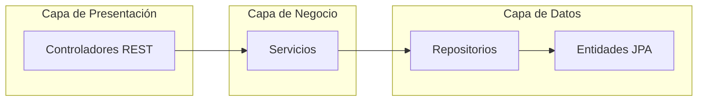
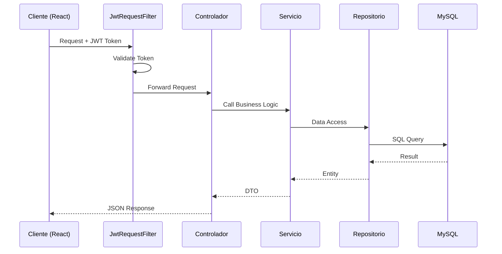
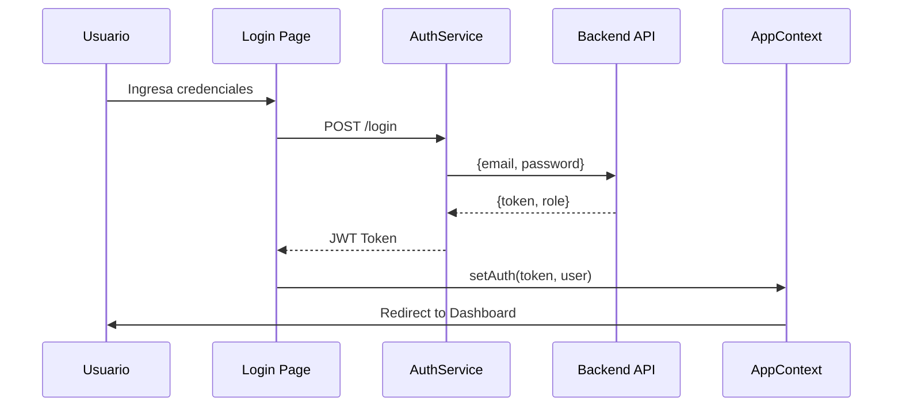
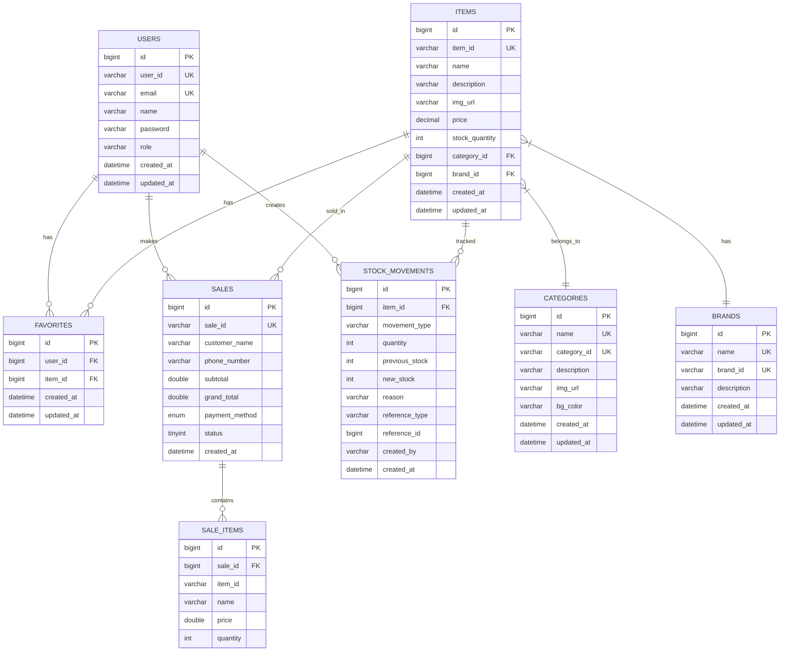

# Arquitectura del Sistema Lunaria

## 1. Visión General del Proyecto

Lunaria es un sistema de gestión de inventario y punto de venta (POS) desarrollado con tecnología Java Spring Boot para el backend y React para el frontend. El sistema permite gestionar productos, categorías, marcas, ventas, inventario y usuarios con autenticación basada en JWT.

### 1.1 Componentes Principales

```mermaid
graph TB
    subgraph Clients["Clientes"]
        Web[("Frontend Web<br/>React + Vite")]
        Mobile[("Frontend Móvil<br/>React Native")]
    end
    
    subgraph Backend["Backend"]
        API[("API REST<br/>Spring Boot 3.4.4")]
        JWT[JWT Auth]
        S3[("AWS S3<br/>Imágenes")]
    end
    
    subgraph Database["Datos"]
        MySQL[(("MySQL<br/>Railway"))]
    end
    
    Web -->|HTTPS| API
    Mobile -->|HTTPS| API
    API -->|JDBC| MySQL
    API -->|SDK| S3
```

### 1.2 Tecnologías Utilizadas

| Capa | Tecnología | Versión |
|------|-------------|---------|
| Backend | Spring Boot | 3.4.4 |
| Lenguaje | Java | 17 |
| Base de Datos | MySQL | 8.0+ |
| Frontend Web | React | 19.0.0 |
| Build Tool | Vite | 6.2.0 |
| Autenticación | JWT (jjwt) | 0.9.1 |
| Almacenamiento | AWS S3 | SDK 2.x |
| Despliegue Backend | Railway | - |
| Despliegue Frontend | Vercel | - |

---

## 2. Arquitectura del Backend

### 2.1 Estructura de Paquetes

El backend sigue una arquitectura MVC (Model-View-Controller) con separación de responsabilidades:

```
com.santiago_rachen.lunaria_backend_springboot/
├── config/           # Configuración de Spring
│   ├── AppConfig.java
│   ├── AWSConfig.java
│   ├── OpenApiConfig.java
│   ├── SecurityConfig.java
│   └── StaticResourceConfig.java
├── controller/       # Controladores REST
│   ├── AuthController.java
│   ├── BrandController.java
│   ├── CategoryController.java
│   ├── DashboardController.java
│   ├── FavoriteController.java
│   ├── ItemController.java
│   ├── SaleController.java
│   ├── StockController.java
│   └── UserController.java
├── entity/           # Entidades JPA
│   ├── BrandEntity.java
│   ├── CategoryEntity.java
│   ├── FavoriteEntity.java
│   ├── ItemEntity.java
│   ├── SaleEntity.java
│   ├── SaleItemEntity.java
│   ├── StockMovement.java
│   ├── UserEntity.java
│   └── ...
├── io/               # DTOs (Request/Response)
├── repository/       # Repositorios JPA
├── service/          # Interfaces de servicio
├── service/impl/     # Implementaciones de servicio
├── filter/           # Filtros JWT
└── util/             # Utilidades
```

### 2.2 Patrón de Diseño

El backend implementa el patrón de arquitectura por capas:



### 2.3 Flujo de Solicitud HTTP



---

## 3. Arquitectura del Frontend

### 3.1 Estructura del Proyecto

```
src/
├── api/
│   └── config.js          # Configuración de Axios
├── assets/                # Imágenes estáticas
├── components/            # Componentes reutilizables
│   ├── BrandForm/
│   ├── BrandList/
│   ├── CartItems/
│   ├── CartSummary/
│   ├── Category/
│   ├── CategoryForm/
│   ├── CategoryList/
│   ├── CustomerForm/
│   ├── DisplayCategory/
│   ├── DisplayItems/
│   ├── Item/
│   ├── ItemForm/
│   ├── ItemList/
│   ├── Menubar/
│   ├── ReceiptPopup/
│   ├── SearchBox/
│   ├── UserForm/
│   └── UsersList/
├── context/
│   └── AppContext.jsx     # Estado global
├── pages/                 # Páginas principales
│   ├── Dashboard/
│   ├── Explore/
│   ├── Favorites/
│   ├── Login/
│   ├── ManageBrand/
│   ├── ManageCategory/
│   ├── ManageItems/
│   ├── ManageStock/
│   ├── ManageUsers/
│   ├── NotFound/
│   ├── Register/
│   ├── SaleHistory/
│   └── ...
└── Service/               # Servicios API
    ├── AuthService.js
    ├── BrandService.js
    ├── CategoryService.js
    ├── Dashboard.js
    ├── FavoriteService.js
    ├── ItemService.js
    ├── SaleService.js
    ├── StockService.js
    └── UserService.js
```

### 3.2 Flujo de Autenticación



---

## 4. Seguridad

### 4.1 Autenticación JWT

El sistema utiliza JWT (JSON Web Tokens) para la autenticación:

- **Algoritmo**: HS256
- **Expiración**: Configurable mediante `jwt.secret.key`
- **Almacenamiento**: LocalStorage en el cliente
- **Protección**: Filtro JWT en cada solicitud

### 4.2 Roles y Permisos

| Rol | Descripción | Endpoints Permitidos |
|-----|-------------|---------------------|
| ROLE_ADMIN | Administrador | Todos los endpoints |
| ROLE_USER | Usuario estándar | /categories, /items, /sales, /dashboard, /favorites |

### 4.3 Configuración CORS

El backend permite conexiones desde:
- `http://localhost:*` (desarrollo)
- `http://192.168.*.*:*` (red local)
- `https://lunariav2-production.up.railway.app` (Railway)
- `https://*.vercel.app` (Vercel)

---

## 5. Despliegue

### 5.1 Arquitectura de Despliegue

```mermaid
graph TB
    subgraph Cloud["Cloud"]
        subgraph Railway["Railway"]
            Backend[("Backend<br/>Spring Boot")]
        end
        
        subgraph Vercel["Vercel"]
            Frontend[("Frontend<br/>React")]
        end
        
        subgraph AWS["AWS"]
            S3[("S3<br/>Imágenes")]
        end
        
        subgraph MySQL["MySQL Railway"]
            DB[(("MySQL<br/>8.0"))]
        end
    end
    
    User((("Usuario"))) -->|HTTPS| Frontend
    Frontend -->|HTTPS| Backend
    Backend -->|JDBC| DB
    Backend -->|SDK| S3
```

### 5.2 Variables de Entorno

#### Backend (Railway)

| Variable | Descripción | Valor por Defecto |
|----------|-------------|-------------------|
| SERVER_PORT | Puerto del servidor | 9090 |
| SPRING_DATASOURCE_URL | URL de MySQL | jdbc:mysql://localhost:3306/lunaria_database |
| SPRING_DATASOURCE_USERNAME | Usuario MySQL | root |
| SPRING_DATASOURCE_PASSWORD | Contraseña MySQL | (vacío) |
| JWT_SECRET_KEY | Clave secreta JWT | lunaria_secret_key_please_change_in_production_minimum_256_bits_required |
| APP_SERVER_URL | URL del servidor | http://localhost:9090 |
| AWS_ACCESS_KEY | Clave AWS | - |
| AWS_SECRET_KEY | Secreto AWS | - |
| AWS_REGION | Región AWS | us-east-1 |
| AWS_BUCKET_NAME | Bucket S3 | - |

#### Frontend (Vercel)

Configurado en `vercel.json` y variables de entorno del proyecto.

---

## 6. Diagrama de Relaciones de Entidades



---

## 7. Resumen de Funcionalidades

### 7.1 Módulos del Sistema

| Módulo | Descripción |
|--------|-------------|
| **Gestión de Usuarios** | Registro, login, roles (ADMIN/USER) |
| **Gestión de Productos** | CRUD de items con imágenes |
| **Gestión de Categorías** | Categorización de productos |
| **Gestión de Marcas** | Administración de marcas |
| **Punto de Venta (POS)** | Carrito de compras, procesamiento de ventas |
| **Gestión de Inventario** | Movimientos de stock, historial |
| **Favoritos** | Productos favoritos por usuario |
| **Dashboard** | Estadísticas y métricas |
| **Subida de Archivos** | Imágenes en AWS S3 |

---

*Documento generado para el proyecto Lunaria v2*
*Tecnologías: Spring Boot 3.4.4 + React 19 + MySQL*
