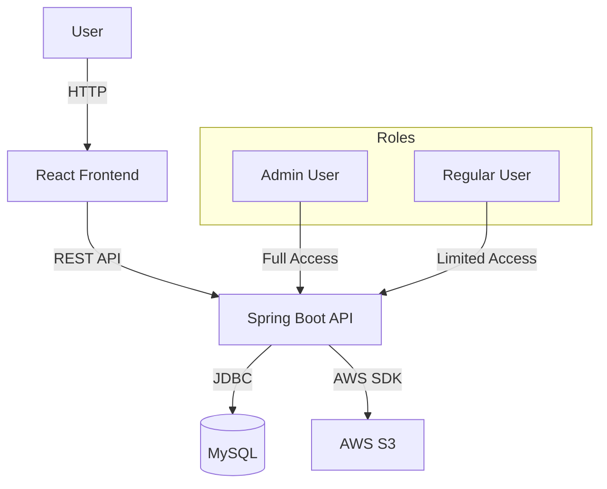
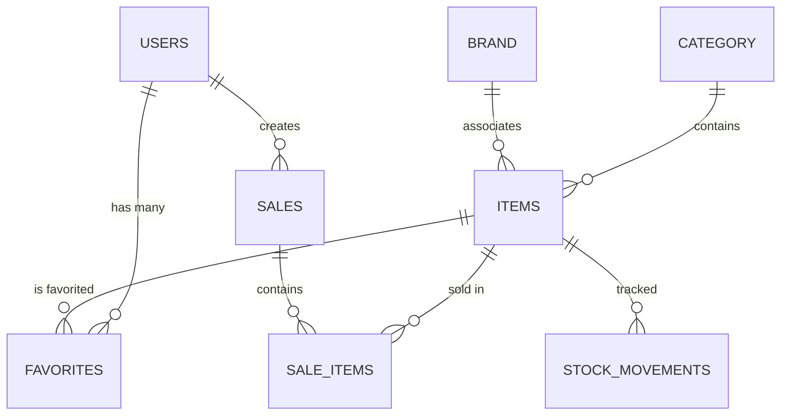

# Lunaria - Complete Project Analysis

## 1. Project Overview

**Lunaria** is a full-stack e-commerce and inventory management application designed for small to medium businesses. The system provides a complete solution for managing products, inventory, sales, and customers.

### Technology Stack

| Component | Technology | Version |
|-----------|------------|---------|
| **Backend** | Spring Boot | 3.4.4 |
| **Language** | Java | 23 |
| **Database** | MySQL | 8.0+ |
| **Frontend** | React | 19.0.0 |
| **Build Tool** | Vite | 6.2.0 |
| **Authentication** | JWT (jjwt) | 0.9.1 |
| **Cloud Storage** | AWS S3 | SDK 2.30.31 |
| **API Documentation** | OpenAPI/Swagger | 3.7.0 |

---

## 2. Architecture

### 2.1 System Architecture



### 2.2 Project Structure

```
Lunaria_v2/
├── 02_database/           # Database scripts
│   ├── create_admin_user.sql
│   └── lunaria_database.sql
├── 03_backend/           # Spring Boot backend
│   └── lunaria-backend-springboot/
│       ├── src/main/java/
│       │   ├── config/       # Configuration classes
│       │   ├── controller/   # REST controllers
│       │   ├── entity/       # JPA entities
│       │   ├── filter/       # JWT filter
│       │   ├── io/           # Request/Response DTOs
│       │   ├── repository/   # Spring Data repositories
│       │   ├── service/      # Business logic
│       │   └── util/          # Utilities
│       └── src/test/         # Unit tests
├── 04_frontend_web/      # React web frontend
│   └── lunaria-frontend-react/
│       ├── src/
│       │   ├── components/  # Reusable components
│       │   ├── context/      # React context
│       │   ├── pages/        # Page components
│       │   └── Service/      # API services
│       └── package.json
└── 05_frontend_mobile/   # (Future mobile app)
```

---

## 3. Database Schema

### 3.1 Tables Overview

| Table | Purpose | Key Fields |
|-------|---------|------------|
| `tbl_users` | User accounts | user_id, email, password, role, name |
| `tbl_category` | Product categories | category_id, name, description, bg_color, img_url |
| `tbl_brand` | Product brands | brand_id, name, description |
| `tbl_items` | Products/Items | item_id, name, description, price, stock_quantity, category_id, brand_id, img_url |
| `tbl_sales` | Sales transactions | sale_id, customer_name, phone_number, grand_total, subtotal, payment_method, status |
| `tbl_sale_items` | Items in each sale | item_id, name, price, quantity, sale_id |
| `tbl_stock_movements` | Inventory history | item_id, movement_type, quantity, previous_stock, new_stock, reason, created_by |
| `tbl_user_favorites` | User favorites | user_id, item_id |

### 3.2 Entity Relationships



---

## 4. API Endpoints

### 4.1 Authentication Endpoints

| Method | Endpoint | Public | Description |
|--------|----------|--------|-------------|
| POST | `/api/v1.0/login` | ✅ | User login, returns JWT |
| POST | `/api/v1.0/register` | ✅ | User registration |
| POST | `/api/v1.0/encode` | ✅ | Password encoding (dev) |

### 4.2 Item Endpoints

| Method | Endpoint | Auth | Description |
|--------|----------|------|-------------|
| GET | `/api/v1.0/items` | ❌ | List all items |
| POST | `/api/v1.0/admin/items` | ADMIN | Create new item |
| PUT | `/api/v1.0/admin/items/{itemId}` | ADMIN | Update item |
| DELETE | `/api/v1.0/admin/items/{itemId}` | ADMIN | Delete item |

### 4.3 Category Endpoints

| Method | Endpoint | Auth | Description |
|--------|----------|------|-------------|
| GET | `/api/v1.0/categories` | ❌ | List all categories |
| POST | `/api/v1.0/admin/categories` | ADMIN | Create category |
| PUT | `/api/v1.0/admin/categories/{id}` | ADMIN | Update category |
| DELETE | `/api/v1.0/admin/categories/{id}` | ADMIN | Delete category |

### 4.4 Brand Endpoints

| Method | Endpoint | Auth | Description |
|--------|----------|------|-------------|
| GET | `/api/v1.0/brands` | ❌ | List all brands |
| POST | `/api/v1.0/admin/brands` | ADMIN | Create brand |
| PUT | `/api/v1.0/admin/brands/{id}` | ADMIN | Update brand |
| DELETE | `/api/v1.0/admin/brands/{id}` | ADMIN | Delete brand |

### 4.5 Sales Endpoints

| Method | Endpoint | Auth | Description |
|--------|----------|------|-------------|
| POST | `/api/v1.0/sales` | ADMIN | Create new sale |
| GET | `/api/v1.0/sales/latest` | USER/ADMIN | Get latest sales |
| DELETE | `/api/v1.0/sales/{saleId}` | USER/ADMIN | Delete sale |

### 4.6 Stock Endpoints

| Method | Endpoint | Auth | Description |
|--------|----------|------|-------------|
| GET | `/api/v1.0/stock/movements` | ADMIN | Get stock movements |
| POST | `/api/v1.0/stock/add` | ADMIN | Add stock |
| POST | `/api/v1.0/stock/remove` | ADMIN | Remove stock |

### 4.7 Dashboard Endpoints

| Method | Endpoint | Auth | Description |
|--------|----------|------|-------------|
| GET | `/api/v1.0/dashboard` | USER/ADMIN | Get dashboard statistics |

### 4.8 Favorites Endpoints

| Method | Endpoint | Auth | Description |
|--------|----------|------|-------------|
| GET | `/api/v1.0/favorites` | USER/ADMIN | Get user favorites |
| POST | `/api/v1.0/favorites/{itemId}` | USER/ADMIN | Add to favorites |
| DELETE | `/api/v1.0/favorites/{itemId}` | USER/ADMIN | Remove from favorites |

---

## 5. Frontend Pages

| Page | Path | Description |
|------|------|-------------|
| Login | `/login` | User authentication |
| Register | `/register` | New user registration |
| Explore | `/` | Browse items |
| Dashboard | `/dashboard` | Admin dashboard with stats |
| Manage Items | `/admin/items` | CRUD for items |
| Manage Categories | `/admin/categories` | CRUD for categories |
| Manage Brands | `/admin/brands` | CRUD for brands |
| Manage Users | `/admin/users` | User management |
| Manage Stock | `/admin/stock` | Inventory management |
| Favorites | `/favorites` | User's favorite items |
| Sale History | `/sales` | View past sales |

---

## 6. Security

### 6.1 Authentication Flow

1. User submits credentials to `/login`
2. Server validates credentials via Spring Security
3. On success, JWT token is generated (JwtUtil)
4. Token is included in subsequent requests via `Authorization: Bearer <token>`
5. JwtRequestFilter validates token on each request

### 6.2 Roles & Permissions

| Role | Permissions |
|------|--------------|
| `ROLE_ADMIN` | Full access to all endpoints |
| `ROLE_USER` | Access to public endpoints, own favorites, limited sales |

### 6.3 CORS Configuration

Allowed origins:
- `http://localhost:5173` (Vite dev server)
- `http://192.168.20.21:9090` (Mobile access)

---

## 7. Key Features Summary

| Feature | Description |
|---------|-------------|
| 🔐 JWT Authentication | Secure login/registration with token-based auth |
| 📦 Product Management | CRUD operations for items with image upload |
| 🏷️ Categories & Brands | Organize products by category and brand |
| 📊 Dashboard | Statistics and overview (sales, items, users) |
| 🛒 Sales Management | Create and track sales transactions |
| 📈 Stock Tracking | Track inventory movements (additions/removals) |
| ❤️ Favorites | Users can save favorite items |
| ☁️ AWS S3 Integration | Cloud storage for product images |
| 📚 API Documentation | OpenAPI/Swagger docs available |

---

## 8. Configuration

### Backend (application.properties)

```properties
server.port=9090
spring.datasource.url=jdbc:mysql://localhost:3306/lunaria_database
spring.datasource.username=root
spring.datasource.password=
spring.jpa.hibernate.ddl-auto=validate
server.servlet.context-path=/api/v1.0
app.server.url=http://10.50.208.83:9090
aws.region=ap-south-1
aws.bucket.name=Lunariaaaa
jwt.secret.key=lunaria_secret_key
```

---

## 9. Build & Run

### Backend

```bash
cd 03_backend/lunaria-backend-springboot
./mvnw spring-boot:run
# Runs on: http://localhost:9090/api/v1.0
```

### Frontend

```bash
cd 04_frontend_web/lunaria-frontend-react
npm install
npm run dev
# Runs on: http://localhost:5173
```

### Database

```bash
mysql -u root -p < 02_database/lunaria_database.sql
mysql -u root -p < 02_database/create_admin_user.sql
```

---

*Document generated as part of Lunaria Project Analysis*
