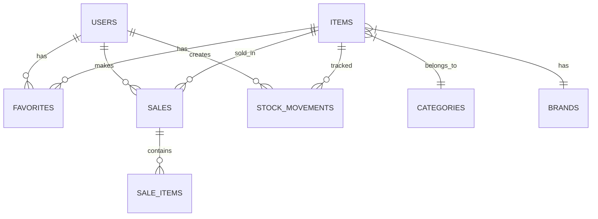

# Documentación de Base de Datos - Lunaria

## 1. Visión General

La base de datos del proyecto Lunaria está construida en **MySQL 8.0** y almacenada en **Railway**. El nombre de la base de datos es `lunaria_database`. El esquema original se llamaba `billing_app` pero fue renombrado para reflejar el nombre del proyecto.

### 1.1 Información de Conexión

| Parámetro | Valor |
|-----------|-------|
| Host | Configurado en Railway |
| Puerto | 3306 (MySQL default) |
| Base de datos | lunaria_database |
| Charset | utf8mb4 |
| Collation | utf8mb4_general_ci |

---

## 2. Modelo Entidad-Relación

### 2.1 Diagrama ER



---

## 3. Tablas de la Base de Datos

### 3.1 Tabla: `tbl_users`

Almacena la información de los usuarios del sistema.

| Campo | Tipo | Restricciones | Descripción |
|-------|------|----------------|-------------|
| `id` | BIGINT | PK, AUTO_INCREMENT | Identificador único |
| `user_id` | VARCHAR(255) | UNIQUE | UUID del usuario |
| `email` | VARCHAR(255) | UNIQUE, NOT NULL | Correo electrónico |
| `name` | VARCHAR(255) | NOT NULL | Nombre del usuario |
| `password` | VARCHAR(255) | NOT NULL | Contraseña encriptada (BCrypt) |
| `role` | VARCHAR(255) | NOT NULL | Rol del usuario (ROLE_ADMIN, ROLE_USER) |
| `created_at` | DATETIME(6) | - | Fecha de creación |
| `updated_at` | DATETIME(6) | - | Fecha de actualización |

```sql
CREATE TABLE `tbl_users` (
  `id` bigint NOT NULL AUTO_INCREMENT,
  `created_at` datetime(6) DEFAULT NULL,
  `email` varchar(255) DEFAULT NULL,
  `name` varchar(255) DEFAULT NULL,
  `password` varchar(255) DEFAULT NULL,
  `role` varchar(255) DEFAULT NULL,
  `updated_at` datetime(6) DEFAULT NULL,
  `user_id` varchar(255) DEFAULT NULL,
  PRIMARY KEY (`id`),
  UNIQUE KEY `UKmjbs9x9gfunub398pfm26lmnd` (`user_id`),
  UNIQUE KEY `UK_users_email` (`email`)
) ENGINE=InnoDB AUTO_INCREMENT=3 DEFAULT CHARSET=utf8mb4;
```

---

### 3.2 Tabla: `tbl_category`

Almacena las categorías de productos.

| Campo | Tipo | Restricciones | Descripción |
|-------|------|----------------|-------------|
| `id` | BIGINT | PK, AUTO_INCREMENT | Identificador único |
| `category_id` | VARCHAR(255) | UNIQUE | UUID de la categoría |
| `name` | VARCHAR(255) | UNIQUE, NOT NULL | Nombre de la categoría |
| `description` | VARCHAR(255) | - | Descripción de la categoría |
| `img_url` | VARCHAR(255) | - | URL de la imagen de la categoría |
| `bg_color` | VARCHAR(255) | - | Color de fondo para la UI |
| `created_at` | DATETIME(6) | - | Fecha de creación |
| `updated_at` | DATETIME(6) | - | Fecha de actualización |

```sql
CREATE TABLE `tbl_category` (
  `id` bigint NOT NULL AUTO_INCREMENT,
  `bg_color` varchar(255) DEFAULT NULL,
  `category_id` varchar(255) DEFAULT NULL,
  `created_at` datetime(6) DEFAULT NULL,
  `description` varchar(255) DEFAULT NULL,
  `img_url` varchar(255) DEFAULT NULL,
  `name` varchar(255) DEFAULT NULL,
  `updated_at` datetime(6) DEFAULT NULL,
  PRIMARY KEY (`id`),
  UNIQUE KEY `UK6tqm19rficylm9e18oxdvr350` (`category_id`),
  UNIQUE KEY `UK8f25rdca1qev4kqtyrxwsx0k8` (`name`)
) ENGINE=InnoDB AUTO_INCREMENT=4 DEFAULT CHARSET=utf8mb4;
```

---

### 3.3 Tabla: `tbl_brand`

Almacena las marcas de los productos.

| Campo | Tipo | Restricciones | Descripción |
|-------|------|----------------|-------------|
| `id` | BIGINT | PK, AUTO_INCREMENT | Identificador único |
| `brand_id` | VARCHAR(255) | UNIQUE | UUID de la marca |
| `name` | VARCHAR(255) | UNIQUE, NOT NULL | Nombre de la marca |
| `description` | VARCHAR(255) | - | Descripción de la marca |
| `created_at` | DATETIME(6) | - | Fecha de creación |
| `updated_at` | DATETIME(6) | - | Fecha de actualización |

```sql
CREATE TABLE `tbl_brand` (
  `id` bigint NOT NULL AUTO_INCREMENT,
  `brand_id` varchar(255) DEFAULT NULL,
  `created_at` datetime(6) DEFAULT NULL,
  `description` varchar(255) DEFAULT NULL,
  `name` varchar(255) DEFAULT NULL,
  `updated_at` datetime(6) DEFAULT NULL,
  PRIMARY KEY (`id`),
  UNIQUE KEY `UK_brand_id` (`brand_id`),
  UNIQUE KEY `UK_brand_name` (`name`)
) ENGINE=InnoDB DEFAULT CHARSET=utf8mb4;
```

---

### 3.4 Tabla: `tbl_items`

Almacena los productos/items del inventario.

| Campo | Tipo | Restricciones | Descripción |
|-------|------|----------------|-------------|
| `id` | BIGINT | PK, AUTO_INCREMENT | Identificador único |
| `item_id` | VARCHAR(255) | UNIQUE | UUID del producto |
| `name` | VARCHAR(255) | NOT NULL | Nombre del producto |
| `description` | VARCHAR(255) | - | Descripción del producto |
| `img_url` | VARCHAR(255) | - | URL de la imagen del producto |
| `price` | DECIMAL(38,2) | NOT NULL | Precio del producto |
| `stock_quantity` | INT | NOT NULL, DEFAULT 0 | Cantidad en stock |
| `category_id` | BIGINT | FK (NOT NULL) | Referencia a categoría |
| `brand_id` | BIGINT | FK (SET NULL) | Referencia a marca |
| `created_at` | DATETIME(6) | - | Fecha de creación |
| `updated_at` | DATETIME(6) | - | Fecha de actualización |

```sql
CREATE TABLE `tbl_items` (
  `id` bigint NOT NULL AUTO_INCREMENT,
  `created_at` datetime(6) DEFAULT NULL,
  `description` varchar(255) DEFAULT NULL,
  `img_url` varchar(255) DEFAULT NULL,
  `item_id` varchar(255) DEFAULT NULL,
  `name` varchar(255) DEFAULT NULL,
  `price` decimal(38,2) DEFAULT NULL,
  `stock_quantity` int NOT NULL DEFAULT '0',
  `updated_at` datetime(6) DEFAULT NULL,
  `category_id` bigint NOT NULL,
  `brand_id` bigint DEFAULT NULL,
  PRIMARY KEY (`id`),
  UNIQUE KEY `UKbbx9gl7bt5u3ktguqkw59ehhf` (`item_id`),
  KEY `FKrxxi38a9m21eltievg2qhhk2n` (`category_id`),
  KEY `FK_brand_items` (`brand_id`),
  CONSTRAINT `FKrxxi38a9m21eltievg2qhhk2n` FOREIGN KEY (`category_id`) REFERENCES `tbl_category` (`id`) ON DELETE RESTRICT,
  CONSTRAINT `FK_brand_items` FOREIGN KEY (`brand_id`) REFERENCES `tbl_brand` (`id`) ON DELETE SET NULL
) ENGINE=InnoDB AUTO_INCREMENT=4 DEFAULT CHARSET=utf8mb4;
```

**Notas:**
- La restricción `ON DELETE RESTRICT` en `category_id` impide eliminar una categoría si tiene productos asociados.
- La restricción `ON DELETE SET NULL` en `brand_id` permite eliminar una marca sin eliminar los productos (se establece como NULL).

---

### 3.5 Tabla: `tbl_sales`

Almacena las ventas realizadas.

| Campo | Tipo | Restricciones | Descripción |
|-------|------|----------------|-------------|
| `id` | BIGINT | PK, AUTO_INCREMENT | Identificador único |
| `sale_id` | VARCHAR(255) | UNIQUE | UUID de la venta |
| `customer_name` | VARCHAR(255) | - | Nombre del cliente |
| `phone_number` | VARCHAR(255) | - | Teléfono del cliente |
| `subtotal` | DOUBLE | - | Subtotal de la venta |
| `grand_total` | DOUBLE | NOT NULL | Total de la venta |
| `payment_method` | ENUM('CASH') | - | Método de pago |
| `status` | TINYINT | CHECK (0-2) | Estado de la venta |
| `created_at` | DATETIME(6) | - | Fecha de creación |

```sql
CREATE TABLE `tbl_sales` (
  `id` bigint NOT NULL AUTO_INCREMENT,
  `created_at` datetime(6) DEFAULT NULL,
  `customer_name` varchar(255) DEFAULT NULL,
  `grand_total` double DEFAULT NULL,
  `sale_id` varchar(255) DEFAULT NULL,
  `status` tinyint DEFAULT NULL,
  `payment_method` enum('CASH') DEFAULT NULL,
  `phone_number` varchar(255) DEFAULT NULL,
  `subtotal` double DEFAULT NULL,
  PRIMARY KEY (`id`)
) ENGINE=InnoDB AUTO_INCREMENT=3 DEFAULT CHARSET=utf8mb4;
```

**Estados de venta:**
- `0`: Pendiente
- `1`: Completada
- `2`: Cancelada

---

### 3.6 Tabla: `tbl_sale_items`

Almacena los productos vendidos en cada venta (relación muchos a muchos).

| Campo | Tipo | Restricciones | Descripción |
|-------|------|----------------|-------------|
| `id` | BIGINT | PK, AUTO_INCREMENT | Identificador único |
| `sale_id` | BIGINT | FK | Referencia a la venta |
| `item_id` | VARCHAR(255) | - | UUID del producto |
| `name` | VARCHAR(255) | - | Nombre del producto al momento de venta |
| `price` | DOUBLE | - | Precio unitario al momento de venta |
| `quantity` | INT | - | Cantidad Vendida |

```sql
CREATE TABLE `tbl_sale_items` (
  `id` bigint NOT NULL AUTO_INCREMENT,
  `item_id` varchar(255) DEFAULT NULL,
  `name` varchar(255) DEFAULT NULL,
  `price` double DEFAULT NULL,
  `quantity` int DEFAULT NULL,
  `sale_id` bigint DEFAULT NULL,
  PRIMARY KEY (`id`),
  KEY `FK_sale_items_sale` (`sale_id`),
  CONSTRAINT `FK_sale_items_sale` FOREIGN KEY (`sale_id`) REFERENCES `tbl_sales` (`id`)
) ENGINE=InnoDB DEFAULT CHARSET=utf8mb4;
```

---

### 3.7 Tabla: `tbl_stock_movements`

Registra todos los movimientos de inventario.

| Campo | Tipo | Restricciones | Descripción |
|-------|------|----------------|-------------|
| `id` | BIGINT | PK, AUTO_INCREMENT | Identificador único |
| `item_id` | BIGINT | FK (NOT NULL) | Referencia al producto |
| `movement_type` | VARCHAR(255) | NOT NULL | Tipo de movimiento |
| `quantity` | INT | NOT NULL | Cantidad del movimiento |
| `previous_stock` | INT | NOT NULL | Stock anterior |
| `new_stock` | INT | NOT NULL | Stock nuevo |
| `reason` | VARCHAR(255) | - | Razón del movimiento |
| `reference_type` | VARCHAR(255) | - | Tipo de referencia (SALE, ADJUSTMENT, etc.) |
| `reference_id` | BIGINT | - | ID de referencia |
| `created_by` | VARCHAR(255) | - | Usuario que realizó el movimiento |
| `created_at` | DATETIME(6) | - | Fecha del movimiento |

```sql
CREATE TABLE `tbl_stock_movements` (
  `id` bigint NOT NULL AUTO_INCREMENT,
  `created_at` datetime(6) DEFAULT NULL,
  `created_by` varchar(255) DEFAULT NULL,
  `movement_type` varchar(255) NOT NULL,
  `new_stock` int NOT NULL,
  `previous_stock` int NOT NULL,
  `quantity` int NOT NULL,
  `reason` varchar(255) DEFAULT NULL,
  `reference_id` bigint DEFAULT NULL,
  `reference_type` varchar(255) DEFAULT NULL,
  `item_id` bigint NOT NULL,
  PRIMARY KEY (`id`),
  KEY `FK_item_stock_movement` (`item_id`),
  CONSTRAINT `FK_item_stock_movement` FOREIGN KEY (`item_id`) REFERENCES `tbl_items` (`id`)
) ENGINE=InnoDB DEFAULT CHARSET=utf8mb4;
```

**Tipos de movimiento:**
- `PURCHASE`: Compura/Ajuste positivo
- `SALE`: Venta (disminuye stock)
- `ADJUSTMENT`: Ajuste manual
- `RETURN`: Devolución

---

### 3.8 Tabla: `tbl_user_favorites`

Almacena los productos favoritos de cada usuario.

| Campo | Tipo | Restricciones | Descripción |
|-------|------|----------------|-------------|
| `id` | BIGINT | PK, AUTO_INCREMENT | Identificador único |
| `user_id` | BIGINT | FK (NOT NULL) | Referencia al usuario |
| `item_id` | BIGINT | FK (NOT NULL) | Referencia al producto |
| `created_at` | DATETIME(6) | - | Fecha de creación |
| `updated_at` | DATETIME(6) | - | Fecha de actualización |

```sql
CREATE TABLE `tbl_user_favorites` (
  `id` bigint NOT NULL AUTO_INCREMENT,
  `created_at` datetime(6) DEFAULT NULL,
  `updated_at` datetime(6) DEFAULT NULL,
  `item_id` bigint NOT NULL,
  `user_id` bigint NOT NULL,
  PRIMARY KEY (`id`),
  UNIQUE KEY `UK_user_item_favorite` (`user_id`, `item_id`),
  KEY `FK_favorite_item` (`item_id`),
  KEY `FK_favorite_user` (`user_id`),
  CONSTRAINT `FK_favorite_item` FOREIGN KEY (`item_id`) REFERENCES `tbl_items` (`id`),
  CONSTRAINT `FK_favorite_user` FOREIGN KEY (`user_id`) REFERENCES `tbl_users` (`id`)
) ENGINE=InnoDB DEFAULT CHARSET=utf8mb4;
```

**Notas:**
- La restricción única `UK_user_item_favorite` garantiza que un usuario no pueda marcar el mismo producto dos veces.

---

## 4. Índices

| Tabla | Índice | Tipo | Columnas |
|-------|--------|------|----------|
| tbl_users | PRIMARY | PRIMARY | id |
| tbl_users | UK_user_id | UNIQUE | user_id |
| tbl_users | UK_users_email | UNIQUE | email |
| tbl_category | PRIMARY | PRIMARY | id |
| tbl_category | UK_category_id | UNIQUE | category_id |
| tbl_category | UK_category_name | UNIQUE | name |
| tbl_brand | PRIMARY | PRIMARY | id |
| tbl_brand | UK_brand_id | UNIQUE | brand_id |
| tbl_brand | UK_brand_name | UNIQUE | name |
| tbl_items | PRIMARY | PRIMARY | id |
| tbl_items | UK_item_id | UNIQUE | item_id |
| tbl_items | FK_category_items | FOREIGN KEY | category_id |
| tbl_items | FK_brand_items | FOREIGN KEY | brand_id |
| tbl_sales | PRIMARY | PRIMARY | id |
| tbl_sales | UK_sale_id | UNIQUE | sale_id |
| tbl_sale_items | PRIMARY | PRIMARY | id |
| tbl_sale_items | FK_sale_items_sale | FOREIGN KEY | sale_id |
| tbl_stock_movements | PRIMARY | PRIMARY | id |
| tbl_stock_movements | FK_item_stock_movement | FOREIGN KEY | item_id |
| tbl_user_favorites | PRIMARY | PRIMARY | id |
| tbl_user_favorites | UK_user_item_favorite | UNIQUE | user_id, item_id |
| tbl_user_favorites | FK_favorite_item | FOREIGN KEY | item_id |
| tbl_user_favorites | FK_favorite_user | FOREIGN KEY | user_id |

---

## 5. Scripts de Inicialización

### 5.1 Crear Base de Datos

```sql
drop database if exists lunaria_database;
create database lunaria_database;
use lunaria_database;
```

### 5.2 Crear Usuario Administrador Inicial

El script `create_admin_user.sql` contiene las instrucciones para crear el usuario administrador inicial:

```sql
-- Consultar el archivo: 02_database/create_admin_user.sql
```

---

## 6. Consideraciones de Diseño

### 6.1 Relaciones

- **Uno a Muchos**: `Category → Items`, `Brand → Items`, `User → Sales`, `User → Favorites`
- **Uno a Muchos (con clave foránea nullable)**: `Brand → Items` (brand puede ser null)
- **Uno a Muchos (identificando)**: `Sale → SaleItems`
- **Muchos a Muchos**: `User ↔ Items` (a través de Favorites)

### 6.2 Timestamps

Todas las tablas principales incluyen:
- `created_at`: Fecha de creación del registro
- `updated_at`: Fecha de última modificación

### 6.3 UUIDs

Se utiliza UUIDs (`varchar(255)`) como identificadores secundarios únicos para:
- `user_id`
- `category_id`
- `brand_id`
- `item_id`
- `sale_id`

Esto proporciona:
- Identificadores únicoglobalmente
- Seguridad (no exponen IDs secuenciales)
- Facilitan la distribución en sistemas distribuidos

---

*Documento generado para el proyecto Lunaria v2*
*Base de datos: MySQL 8.0 en Railway*
