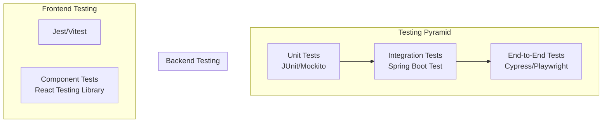

# Lunaria - Software Testing Guide

This guide provides a comprehensive testing strategy for the Lunaria application, covering unit testing, integration testing, and end-to-end testing.

---

## 1. Testing Strategy Overview



---

## 2. Backend Testing

### 2.1 Dependencies Already Included

The backend already has testing dependencies in `pom.xml`:
```xml
<dependency>
    <groupId>org.springframework.boot</groupId>
    <artifactId>spring-boot-starter-test</artifactId>
    <scope>test</scope>
</dependency>
```

### 2.2 Required Additional Dependencies

Add to `pom.xml` for enhanced testing:

```xml
<!-- For testing with H2 database -->
<dependency>
    <groupId>com.h2database</groupId>
    <artifactId>h2</artifactId>
    <scope>test</scope>
</dependency>

<!-- For REST API testing -->
<dependency>
    <groupId>io.rest-assured</groupId>
    <artifactId>rest-assured</artifactId>
    <version>5.4.0</version>
    <scope>test</scope>
</dependency>
```

### 2.3 Unit Tests Structure

Create test files in: `src/test/java/com/santiago_rachen/lunaria_backend_springboot/`

```
src/test/
├── java/
│   └── com/
│       └── santiago_rachen/
│           └── lunaria_backend_springboot/
│               ├── controller/
│               │   ├── AuthControllerTest.java
│               │   ├── ItemControllerTest.java
│               │   ├── SaleControllerTest.java
│               │   └── CategoryControllerTest.java
│               ├── service/
│               │   ├── ItemServiceTest.java
│               │   ├── SaleServiceTest.java
│               │   └── UserServiceTest.java
│               ├── repository/
│               │   ├── ItemRepositoryTest.java
│               │   └── UserRepositoryTest.java
│               └── util/
│                   └── JwtUtilTest.java
└── resources/
    ├── application-test.properties
    └── data.sql
```

### 2.4 Test Configuration

Create `src/test/resources/application-test.properties`:

```properties
# H2 In-Memory Database
spring.datasource.url=jdbc:h2:mem:testdb
spring.datasource.driverClassName=org.h2.Driver
spring.datasource.username=sa
spring.datasource.password=

# JPA settings
spring.jpa.hibernate.ddl-auto=create-drop
spring.jpa.show-sql=true

# JWT settings (same as main config)
jwt.secret.key=lunaria_secret_key

# Disable AWS S3 for tests
aws.bucket.name=test-bucket
```

### 2.5 Sample Unit Tests

#### ItemServiceTest.java

```java
package com.santiago_rachen.lunaria_backend_springboot.service;

import com.santiago_rachen.lunaria_backend_springboot.entity.ItemEntity;
import com.santiago_rachen.lunaria_backend_springboot.entity.CategoryEntity;
import com.santiago_rachen.lunaria_backend_springboot.repository.ItemRepository;
import com.santiago_rachen.lunaria_backend_springboot.repository.CategoryRepository;
import com.santiago_rachen.lunaria_backend_springboot.io.ItemRequest;
import com.santiago_rachen.lunaria_backend_springboot.io.ItemResponse;
import org.junit.jupiter.api.BeforeEach;
import org.junit.jupiter.api.Test;
import org.junit.jupiter.api.extension.ExtendWith;
import org.mockito.InjectMocks;
import org.mockito.Mock;
import org.mockito.junit.jupiter.MockitoExtension;

import java.math.BigDecimal;
import java.util.Arrays;
import java.util.List;
import java.util.Optional;
import java.util.UUID;

import static org.junit.jupiter.api.Assertions.*;
import static org.mockito.ArgumentMatchers.any;
import static org.mockito.Mockito.*;

@ExtendWith(MockitoExtension.class)
class ItemServiceTest {

    @Mock
    private ItemRepository itemRepository;

    @Mock
    private CategoryRepository categoryRepository;

    @InjectMocks
    private ItemServiceImpl itemService;

    private ItemEntity testItem;
    private CategoryEntity testCategory;
    private ItemRequest testRequest;

    @BeforeEach
    void setUp() {
        testCategory = new CategoryEntity();
        testCategory.setId(1L);
        testCategory.setName("Electronics");
        testCategory.setCategoryId(UUID.randomUUID().toString());

        testItem = new ItemEntity();
        testItem.setId(1L);
        testItem.setItemId(UUID.randomUUID().toString());
        testItem.setName("Test Product");
        testItem.setDescription("Test Description");
        testItem.setPrice(new BigDecimal("99.99"));
        testItem.setStockQuantity(10);
        testItem.setCategory(testCategory);

        testRequest = new ItemRequest();
        testRequest.setName("Test Product");
        testRequest.setDescription("Test Description");
        testRequest.setPrice(new BigDecimal("99.99"));
        testRequest.setStockQuantity(10);
        testRequest.setCategoryId(1L);
    }

    @Test
    void testFetchItems_ReturnsAllItems() {
        // Arrange
        when(itemRepository.findAll()).thenReturn(Arrays.asList(testItem));

        // Act
        List<ItemResponse> result = itemService.fetchItems();

        // Assert
        assertNotNull(result);
        assertEquals(1, result.size());
        assertEquals("Test Product", result.get(0).getName());
        verify(itemRepository, times(1)).findAll();
    }

    @Test
    void testAddItem_Success() {
        // Arrange
        when(categoryRepository.findById(1L)).thenReturn(Optional.of(testCategory));
        when(itemRepository.save(any(ItemEntity.class))).thenReturn(testItem);

        // Act
        ItemResponse result = itemService.add(testRequest, null);

        // Assert
        assertNotNull(result);
        assertEquals("Test Product", result.getName());
        verify(itemRepository, times(1)).save(any(ItemEntity.class));
    }

    @Test
    void testAddItem_CategoryNotFound() {
        // Arrange
        when(categoryRepository.findById(1L)).thenReturn(Optional.empty());

        // Act & Assert
        assertThrows(Exception.class, () -> itemService.add(testRequest, null));
    }

    @Test
    void testDeleteItem_Success() {
        // Arrange
        String itemId = testItem.getItemId();
        when(itemRepository.findByItemId(itemId)).thenReturn(Optional.of(testItem));

        // Act
        itemService.deleteItem(itemId);

        // Assert
        verify(itemRepository, times(1)).delete(testItem);
    }
}
```

#### AuthControllerTest.java (Integration Test)

```java
package com.santiago_rachen.lunaria_backend_springboot.controller;

import com.fasterxml.jackson.databind.ObjectMapper;
import com.santiago_rachen.lunaria_backend_springboot.io.AuthRequest;
import com.santiago_rachen.lunaria_backend_springboot.io.UserRequest;
import org.junit.jupiter.api.Test;
import org.springframework.beans.factory.annotation.Autowired;
import org.springframework.boot.test.autoconfigure.web.servlet.AutoConfigureMockMvc;
import org.springframework.boot.test.context.SpringBootTest;
import org.springframework.http.MediaType;
import org.springframework.test.web.servlet.MockMvc;

import static org.springframework.test.web.servlet.request.MockMvcRequestBuilders.*;
import static org.springframework.test.web.servlet.result.MockMvcResultMatchers.*;

@SpringBootTest
@AutoConfigureMockMvc
class AuthControllerTest {

    @Autowired
    private MockMvc mockMvc;

    @Autowired
    private ObjectMapper objectMapper;

    @Test
    void testRegisterUser_Success() throws Exception {
        UserRequest request = new UserRequest();
        request.setEmail("test" + System.currentTimeMillis() + "@example.com");
        request.setPassword("password123");
        request.setName("Test User");

        mockMvc.perform(post("/register")
                .contentType(MediaType.APPLICATION_JSON)
                .content(objectMapper.writeValueAsString(request)))
                .andExpect(status().isCreated())
                .andExpect(jsonPath("$.email").value(request.getEmail()));
    }

    @Test
    void testRegisterUser_DuplicateEmail() throws Exception {
        UserRequest request = new UserRequest();
        request.setEmail("admin@lunaria.com");
        request.setPassword("password123");
        request.setName("Test User");

        mockMvc.perform(post("/register")
                .contentType(MediaType.APPLICATION_JSON)
                .content(objectMapper.writeValueAsString(request)))
                .andExpect(status().isBadRequest());
    }

    @Test
    void testLogin_InvalidCredentials() throws Exception {
        AuthRequest request = new AuthRequest();
        request.setEmail("invalid@example.com");
        request.setPassword("wrongpassword");

        mockMvc.perform(post("/login")
                .contentType(MediaType.APPLICATION_JSON)
                .content(objectMapper.writeValueAsString(request)))
                .andExpect(status().isBadRequest());
    }
}
```

### 2.6 Running Backend Tests

```bash
# Run all tests
cd 03_backend/lunaria-backend-springboot
./mvnw test

# Run specific test class
./mvnw test -Dtest=ItemServiceTest

# Run tests with coverage report
./mvnw test -Djacoco.skip=false

# Run tests in verbose mode
./mvnw test -X
```

---

## 3. Frontend Testing

### 3.1 Setup Testing Dependencies

```bash
cd 04_frontend_web/lunaria-frontend-react
npm install --save-dev @testing-library/react @testing-library/jest-dom @testing-library/user-event vitest jsdom
```

### 3.2 Update package.json

```json
{
  "scripts": {
    "test": "vitest",
    "test:ui": "vitest --ui",
    "test:coverage": "vitest --coverage"
  }
}
```

### 3.3 Create Test Setup

Create `src/test/setup.js`:

```javascript
import { expect, afterEach, beforeAll, afterAll } from 'vitest';
import { cleanup } from '@testing-library/react';
import '@testing-library/jest-dom/vitest';

// Cleanup after each test
afterEach(() => {
  cleanup();
});

// Mock localStorage
const localStorageMock = {
  getItem: vi.fn(),
  setItem: vi.fn(),
  removeItem: vi.fn(),
  clear: vi.fn(),
};
global.localStorage = localStorageMock;
```

Create `vite.config.js` (update):

```javascript
import { defineConfig } from 'vite';
import react from '@vitejs/plugin-react';

export default defineConfig({
  plugins: [react()],
  test: {
    globals: true,
    environment: 'jsdom',
    setupFiles: './src/test/setup.js',
    include: ['src/**/*.{test,spec}.{js,jsx}'],
  },
});
```

### 3.4 Sample Component Tests

#### ItemService.test.js

```javascript
import { describe, it, expect, vi, beforeEach } from 'vitest';
import axios from 'axios';
import ItemService from '../Service/ItemService';

vi.mock('axios');

describe('ItemService', () => {
  beforeEach(() => {
    vi.clearAllMocks();
  });

  describe('fetchItems', () => {
    it('should fetch all items successfully', async () => {
      const mockItems = [
        { id: 1, name: 'Item 1', price: 100 },
        { id: 2, name: 'Item 2', price: 200 },
      ];
      
      axios.get.mockResolvedValueOnce({ data: mockItems });

      const result = await ItemService.fetchItems();

      expect(axios.get).toHaveBeenCalledWith('/items');
      expect(result).toEqual(mockItems);
    });

    it('should handle API error', async () => {
      axios.get.mockRejectedValueOnce(new Error('Network error'));

      await expect(ItemService.fetchItems()).rejects.toThrow('Network error');
    });
  });

  describe('addItem', () => {
    it('should create new item successfully', async () => {
      const newItem = { name: 'New Item', price: 150 };
      const mockResponse = { id: 3, ...newItem };

      axios.post.mockResolvedValueOnce({ data: mockResponse });

      const result = await ItemService.addItem(newItem, null);

      expect(axios.post).toHaveBeenCalledWith('/admin/items', expect.any(FormData));
      expect(result).toEqual(mockResponse);
    });
  });
});
```

#### Login.test.jsx

```javascript
import { describe, it, expect, vi } from 'vitest';
import { render, screen, waitFor } from '@testing-library/react';
import userEvent from '@testing-library/user-event';
import { BrowserRouter } from 'react-router-dom';
import Login from '../pages/Login/Login';
import AuthService from '../Service/AuthService';

vi.mock('../Service/AuthService');

const renderLogin = () => {
  return render(
    <BrowserRouter>
      <Login />
    </BrowserRouter>
  );
};

describe('Login Page', () => {
  it('should render login form', () => {
    renderLogin();
    
    expect(screen.getByLabelText(/email/i)).toBeInTheDocument();
    expect(screen.getByLabelText(/password/i)).toBeInTheDocument();
    expect(screen.getByRole('button', { name: /login/i })).toBeInTheDocument();
  });

  it('should show validation errors on empty submit', async () => {
    renderLogin();
    
    await userEvent.click(screen.getByRole('button', { name: /login/i }));
    
    await waitFor(() => {
      expect(screen.getByText(/email is required/i)).toBeInTheDocument();
    });
  });

  it('should call login API on valid submission', async () => {
    const mockResponse = { 
      token: 'mock-token', 
      role: 'ROLE_ADMIN',
      email: 'admin@lunaria.com'
    };
    
    AuthService.login.mockResolvedValueOnce(mockResponse);
    localStorage.setItem = vi.fn();

    renderLogin();
    
    await userEvent.type(screen.getByLabelText(/email/i), 'admin@lunaria.com');
    await userEvent.type(screen.getByLabelText(/password/i), 'password123');
    await userEvent.click(screen.getByRole('button', { name: /login/i }));

    await waitFor(() => {
      expect(AuthService.login).toHaveBeenCalledWith({
        email: 'admin@lunaria.com',
        password: 'password123'
      });
    });
  });
});
```

### 3.5 Running Frontend Tests

```bash
cd 04_frontend_web/lunaria-frontend-react

# Run all tests
npm test

# Run tests in watch mode
npm test -- --watch

# Run tests with coverage
npm run test:coverage

# Run tests with UI
npm run test:ui
```

---

## 4. Integration Testing

### 4.1 API Integration Tests

Create integration tests that test the full flow:

```java
@SpringBootTest(webEnvironment = SpringBootTest.WebEnvironment.RANDOM_PORT)
@AutoConfigureMockMvc
class SaleIntegrationTest {

    @Autowired
    private MockMvc mockMvc;

    @Autowired
    private ObjectMapper objectMapper;

    private String adminToken;
    private String userToken;

    @BeforeEach
    void setUp() throws Exception {
        // Login as admin and get token
        adminToken = loginAndGetToken("admin@lunaria.com", "admin123");
        
        // Login as regular user and get token
        userToken = loginAndGetToken("user@lunaria.com", "user123");
    }

    private String loginAndGetToken(String email, String password) throws Exception {
        AuthRequest request = new AuthRequest(email, password);
        
        MvcResult result = mockMvc.perform(post("/login")
                .contentType(MediaType.APPLICATION_JSON)
                .content(objectMapper.writeValueAsString(request)))
                .andExpect(status().isOk())
                .andReturn();
        
        AuthResponse response = objectMapper.readValue(
                result.getResponse().getContentAsString(), 
                AuthResponse.class
        );
        
        return response.getToken();
    }

    @Test
    void testCreateSale_AsAdmin_Success() throws Exception {
        SaleRequest request = new SaleRequest();
        request.setCustomerName("Test Customer");
        request.setPaymentMethod(PaymentMethod.CASH);
        // Add items...

        mockMvc.perform(post("/sales")
                .header("Authorization", "Bearer " + adminToken)
                .contentType(MediaType.APPLICATION_JSON)
                .content(objectMapper.writeValueAsString(request)))
                .andExpect(status().isCreated())
                .andExpect(jsonPath("$.customerName").value("Test Customer"));
    }

    @Test
    void testCreateSale_AsUser_Forbidden() throws Exception {
        SaleRequest request = new SaleRequest();
        
        mockMvc.perform(post("/sales")
                .header("Authorization", "Bearer " + userToken)
                .contentType(MediaType.APPLICATION_JSON)
                .content(objectMapper.writeValueAsString(request)))
                .andExpect(status().isForbidden());
    }
}
```

---

## 5. Test Checklist

### 5.1 Backend Test Checklist

| Category | Test Case | Priority |
|----------|-----------|----------|
| **Auth** | Login with valid credentials | High |
| **Auth** | Login with invalid credentials | High |
| **Auth** | Register new user | High |
| **Auth** | Register duplicate email | Medium |
| **Auth** | JWT token validation | High |
| **Items** | Create item (admin) | High |
| **Items** | Get all items | High |
| **Items** | Update item (admin) | High |
| **Items** | Delete item (admin) | High |
| **Categories** | CRUD operations | Medium |
| **Brands** | CRUD operations | Medium |
| **Sales** | Create sale (admin) | High |
| **Sales** | Get sales list | Medium |
| **Sales** | Delete sale | Medium |
| **Stock** | Add stock | High |
| **Stock** | Remove stock | High |
| **Stock** | Stock movement history | Medium |
| **Dashboard** | Get statistics | Medium |
| **Favorites** | Add/remove favorites | Medium |

### 5.2 Frontend Test Checklist

| Category | Test Case | Priority |
|----------|-----------|----------|
| **Login** | Valid credentials | High |
| **Login** | Invalid credentials | High |
| **Register** | New user registration | High |
| **Register** | Duplicate email | Medium |
| **Items** | Display items list | High |
| **Items** | Add new item form | High |
| **Items** | Edit item | Medium |
| **Items** | Delete item | Medium |
| **Cart** | Add to cart | High |
| **Cart** | Remove from cart | High |
| **Cart** | Checkout flow | High |
| **Favorites** | Add to favorites | Medium |
| **Favorites** | Remove from favorites | Medium |
| **Navigation** | Menu routing | Medium |

---

## 6. CI/CD Integration

### 6.1 GitHub Actions Example

Create `.github/workflows/test.yml`:

```yaml
name: Run Tests

on:
  push:
    branches: [ main, develop ]
  pull_request:
    branches: [ main, develop ]

jobs:
  backend-tests:
    runs-on: ubuntu-latest
    
    steps:
      - uses: actions/checkout@v3
      
      - name: Set up JDK 23
        uses: actions/setup-java@v3
        with:
          java-version: '23'
          distribution: 'temurin'
          
      - name: Run Backend Tests
        run: |
          cd 03_backend/lunaria-backend-springboot
          ./mvnw test
      
      - name: Upload Backend Test Results
        uses: actions/upload-artifact@v3
        if: always()
        with:
          name: backend-test-results
          path: 03_backend/lunaria-backend-springboot/target/surefire-reports/

  frontend-tests:
    runs-on: ubuntu-latest
    
    steps:
      - uses: actions/checkout@v3
      
      - name: Set up Node.js
        uses: actions/setup-node@v3
        with:
          node-version: '20'
          
      - name: Install Dependencies
        run: |
          cd 04_frontend_web/lunaria-frontend-react
          npm ci
          
      - name: Run Frontend Tests
        run: |
          cd 04_frontend_web/lunaria-frontend-react
          npm run test:coverage
          
      - name: Upload Frontend Coverage
        uses: codecov/codecov-action@v3
```

---

## 7. Test Coverage Goals

| Module | Minimum Coverage |
|--------|------------------|
| Controllers | 70% |
| Services | 80% |
| Repositories | 60% |
| Utils | 90% |
| **Overall** | **70%** |

---

*Testing Guide generated for Lunaria Project*
