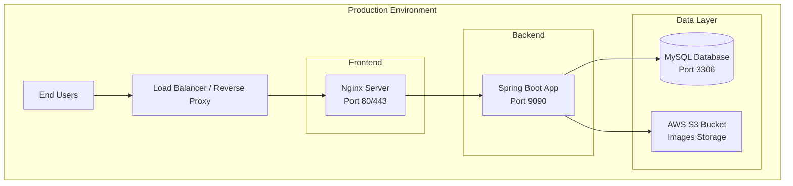

# Lunaria - Deployment Guide

This guide covers the complete deployment process for the Lunaria application, from local development to production environments.

---

## 1. Deployment Architecture



---

## 2. Pre-Deployment Checklist

### 2.1 Prerequisites

| Requirement | Version | Purpose |
|-------------|---------|---------|
| Java JDK | 23+ | Backend runtime |
| Node.js | 20+ | Frontend build |
| MySQL | 8.0+ | Database |
| Maven | 3.9+ | Backend build |
| Nginx | 1.24+ | Reverse proxy |
| AWS Account | - | S3 storage |

### 2.2 Environment Variables Needed

```bash
# Database
DB_HOST=localhost
DB_PORT=3306
DB_NAME=lunaria_database
DB_USER=root
DB_PASSWORD=your_secure_password

# JWT
JWT_SECRET_KEY=your_secure_jwt_secret_min_256_bits

# AWS S3
AWS_ACCESS_KEY=your_aws_access_key
AWS_SECRET_KEY=your_aws_secret_key
AWS_REGION=your_region
AWS_BUCKET_NAME=your_bucket_name

# Application
APP_SERVER_URL=http://your-server-ip:9090
```

---

## 3. Database Setup

### 3.1 MySQL Installation & Configuration

**Ubuntu/Debian:**
```bash
sudo apt update
sudo apt install mysql-server

# Start MySQL
sudo systemctl start mysql
sudo systemctl enable mysql

# Secure installation
sudo mysql_secure_installation
```

**Windows:**
1. Download MySQL Installer from https://dev.mysql.com/downloads/installer/
2. Run installer and follow wizard
3. Start MySQL service from Services

### 3.2 Create Database

```bash
mysql -u root -p

# Run database creation script
SOURCE /path/to/Lunaria_v2/02_database/lunaria_database.sql;

# Create admin user
SOURCE /path/to/Lunaria_v2/02_database/create_admin_user.sql;
```

### 3.3 Database Backup Strategy

```bash
# Create backup script (backup.sh)
#!/bin/bash
DATE=$(date +%Y%m%d_%H%M%S)
mysqldump -u root -p lunaria_database > /backups/lunaria_$DATE.sql

# Schedule daily backups (cron)
crontab -e
# Add: 0 2 * * * /path/to/backup.sh
```

---

## 4. Backend Deployment

### 4.1 Build the Application

```bash
cd 03_backend/lunaria-backend-springboot

# Clean and build
./mvnw clean package -DskipTests

# Verify JAR was created
ls -la target/*.jar
```

### 4.2 Create Production Configuration

Create `src/main/resources/application-prod.properties`:

```properties
# Server Configuration
server.port=9090
server.servlet.context-path=/api/v1.0

# Database Configuration
spring.datasource.url=jdbc:mysql://${DB_HOST:localhost}:${DB_PORT:3306}/${DB_NAME:lunaria_database}?useSSL=false&allowPublicKeyRetrieval=true&serverTimezone=UTC
spring.datasource.username=${DB_USER:root}
spring.datasource.password=${DB_PASSWORD}
spring.datasource.driver-class-name=com.mysql.cj.jdbc.Driver

# JPA Configuration
spring.jpa.hibernate.ddl-auto=validate
spring.jpa.show-sql=false
spring.jpa.properties.hibernate.dialect=org.hibernate.dialect.MySQLDialect

# JWT Configuration
jwt.secret.key=${JWT_SECRET_KEY}

# AWS S3 Configuration
aws.access.key=${AWS_ACCESS_KEY}
aws.secret.key=${AWS_SECRET_KEY}
aws.region=${AWS_REGION:us-east-1}
aws.bucket.name=${AWS_BUCKET_NAME}

# Server URL for image URLs
app.server.url=${APP_SERVER_URL:http://localhost:9090}

# Logging
logging.level.root=INFO
logging.level.com.santiago_rachen=DEBUG
logging.file.name=/var/log/lunaria/application.log
```

### 4.3 Create Systemd Service

Create `/etc/systemd/system/lunaria-backend.service`:

```ini
[Unit]
Description=Lunaria Backend Application
After=syslog.target network.target mysql.service

[Service]
Type=simple
User=lunaria
Group=lunaria
WorkingDirectory=/opt/lunaria/backend
ExecStart=/usr/bin/java -jar -Dspring.profiles.active=prod /opt/lunaria/backend/lunaria-backend-springboot-0.0.1-SNAPSHOT.jar
ExecStop=/bin/kill -15 $MAINPID
Restart=always
RestartSec=10

# Environment variables
Environment="DB_HOST=localhost"
Environment="DB_PASSWORD=your_secure_password"
Environment="JWT_SECRET_KEY=your_secure_jwt_key"
Environment="AWS_ACCESS_KEY=your_aws_key"
Environment="AWS_SECRET_KEY=your_aws_secret"
Environment="AWS_REGION=us-east-1"
Environment="AWS_BUCKET_NAME=your-bucket"

[Install]
WantedBy=multi-user.target
```

### 4.4 Deploy Backend

```bash
# Create application directory
sudo mkdir -p /opt/lunaria/backend
sudo mkdir -p /var/log/lunaria

# Copy JAR file
sudo cp target/lunaria-backend-springboot-0.0.1-SNAPSHOT.jar /opt/lunaria/backend/

# Create user and set permissions
sudo useradd -r -s /bin/false lunaria || true
sudo chown -R lunaria:lunaria /opt/lunaria
sudo chown -R lunaria:lunaria /var/log/lunaria

# Reload systemd and start service
sudo systemctl daemon-reload
sudo systemctl start lunaria-backend
sudo systemctl enable lunaria-backend

# Check status
sudo systemctl status lunaria-backend
```

---

## 5. Frontend Deployment

### 5.1 Build for Production

```bash
cd 04_frontend_web/lunaria-frontend-react

# Update API base URL in source code if needed
# Edit: src/Service/ApiConfig.js or similar

# Build production bundle
npm run build
```

### 5.2 Nginx Configuration

Create `/etc/nginx/sites-available/lunaria`:

```nginx
server {
    listen 80;
    server_name your-domain.com OR your-server-ip;

    # Frontend static files
    location / {
        root /var/www/lunaria-frontend/dist;
        index index.html;
        try_files $uri $uri/ /index.html;
        
        # Cache static assets
        location ~* \.(js|css|png|jpg|jpeg|gif|ico|svg|webp)$ {
            expires 1y;
            add_header Cache-Control "public, immutable";
        }
    }

    # Backend API proxy
    location /api/ {
        proxy_pass http://localhost:9090/api/;
        proxy_http_version 1.1;
        proxy_set_header Upgrade $http_upgrade;
        proxy_set_header Connection 'upgrade';
        proxy_set_header Host $host;
        proxy_set_header X-Real-IP $remote_addr;
        proxy_set_header X-Forwarded-For $proxy_add_x_forwarded_for;
        proxy_set_header X-Forwarded-Proto $scheme;
        proxy_cache_bypass $http_upgrade;
        
        # Timeouts
        proxy_connect_timeout 60s;
        proxy_send_timeout 60s;
        proxy_read_timeout 60s;
    }

    # Uploaded files
    location /uploads/ {
        proxy_pass http://localhost:9090/uploads/;
        proxy_set_header Host $host;
    }

    # Security headers
    add_header X-Frame-Options "SAMEORIGIN" always;
    add_header X-Content-Type-Options "nosniff" always;
    add_header X-XSS-Protection "1; mode=block" always;
}
```

### 5.3 Deploy Frontend

```bash
# Create web directory
sudo mkdir -p /var/www/lunaria-frontend

# Copy build files
sudo cp -r dist/* /var/www/lunaria-frontend/

# Set permissions
sudo chown -R www-data:www-data /var/www/lunaria-frontend

# Enable site
sudo ln -s /etc/nginx/sites-available/lunaria /etc/nginx/sites-enabled/

# Test nginx config
sudo nginx -t

# Restart nginx
sudo systemctl restart nginx
sudo systemctl enable nginx
```

---

## 6. SSL/HTTPS Configuration

### 6.1 Using Certbot (Let's Encrypt)

```bash
# Install Certbot
sudo apt install certbot python3-certbot-nginx

# Get SSL certificate
sudo certbot --nginx -d your-domain.com

# Auto-renewal (Certbot handles this automatically)
# Test renewal with: sudo certbot renew --dry-run
```

### 6.2 Update Nginx for HTTPS

```nginx
server {
    listen 443 ssl http2;
    server_name your-domain.com;
    
    ssl_certificate /etc/letsencrypt/live/your-domain.com/fullchain.pem;
    ssl_certificate_key /etc/letsencrypt/live/your-domain.com/privkey.pem;
    ssl_protocols TLSv1.2 TLSv1.3;
    ssl_ciphers ECDHE-ECDSA-AES128-GCM-SHA256:ECDHE-RSA-AES128-GCM-SHA256;
    
    # ... rest of config
}

# Redirect HTTP to HTTPS
server {
    listen 80;
    server_name your-domain.com;
    return 301 https://$server_name$request_uri;
}
```

---

## 7. Docker Deployment (Alternative)

### 7.1 Dockerfile for Backend

Create `03_backend/lunaria-backend-springboot/Dockerfile`:

```dockerfile
FROM eclipse-temurin:23-jdk-alpine AS build
WORKDIR /app
COPY pom.xml .
COPY src ./src
RUN apk add --no-cache maven && \
    mvn clean package -DskipTests

FROM eclipse-temurin:23-jre-alpine
WORKDIR /app
COPY --from=build /app/target/*.jar app.jar
EXPOSE 9090
ENTRYPOINT ["java", "-jar", "app.jar"]
```

### 7.2 Dockerfile for Frontend

Create `04_frontend_web/lunaria-frontend-react/Dockerfile`:

```dockerfile
# Build stage
FROM node:20-alpine AS build
WORKDIR /app
COPY package*.json ./
RUN npm ci
COPY . .
RUN npm run build

# Production stage
FROM nginx:alpine
COPY --from=build /app/dist /usr/share/nginx/html
COPY nginx.conf /etc/nginx/conf.d/default.conf
EXPOSE 80
CMD ["nginx", "-g", "daemon off;"]
```

### 7.3 Docker Compose

Create `docker-compose.yml` in project root:

```yaml
version: '3.8'

services:
  mysql:
    image: mysql:8.0
    container_name: lunaria-mysql
    restart: always
    environment:
      MYSQL_ROOT_PASSWORD: ${DB_PASSWORD}
      MYSQL_DATABASE: lunaria_database
    volumes:
      - mysql_data:/var/lib/mysql
      - ./02_database:/docker-entrypoint-initdb.d
    ports:
      - "3306:3306"
    networks:
      - lunaria-network

  backend:
    build: ./03_backend/lunaria-backend-springboot
    container_name: lunaria-backend
    restart: always
    environment:
      SPRING_DATASOURCE_URL: jdbc:mysql://mysql:3306/lunaria_database
      SPRING_DATASOURCE_USERNAME: root
      SPRING_DATASOURCE_PASSWORD: ${DB_PASSWORD}
      JWT_SECRET_KEY: ${JWT_SECRET_KEY}
      AWS_ACCESS_KEY: ${AWS_ACCESS_KEY}
      AWS_SECRET_KEY: ${AWS_SECRET_KEY}
      AWS_REGION: ${AWS_REGION}
      AWS_BUCKET_NAME: ${AWS_BUCKET_NAME}
    depends_on:
      - mysql
    ports:
      - "9090:9090"
    networks:
      - lunaria-network

  frontend:
    build: ./04_frontend_web/lunaria-frontend-react
    container_name: lunaria-frontend
    restart: always
    ports:
      - "80:80"
    depends_on:
      - backend
    networks:
      - lunaria-network

volumes:
  mysql_data:

networks:
  lunaria-network:
    driver: bridge
```

### 7.4 Deploy with Docker

```bash
# Create .env file
cat > .env << EOF
DB_PASSWORD=your_secure_password
JWT_SECRET_KEY=your_secure_jwt_key_min_256_bits
AWS_ACCESS_KEY=your_aws_access_key
AWS_SECRET_KEY=your_aws_secret_key
AWS_REGION=us-east-1
AWS_BUCKET_NAME=your-bucket-name
EOF

# Build and start all containers
docker-compose up -d

# View logs
docker-compose logs -f

# Check status
docker-compose ps
```

---

## 8. Monitoring & Maintenance

### 8.1 Health Checks

```bash
# Backend health endpoint
curl http://localhost:9090/api/v1.0/actuator/health

# Add to pom.xml for actuator:
# <dependency>
#     <groupId>org.springframework.boot</groupId>
#     <artifactId>spring-boot-starter-actuator</artifactId>
# </dependency>
```

### 8.2 Log Management

```bash
# View application logs
sudo journalctl -u lunaria-backend -f

# Or use log files
tail -f /var/log/lunaria/application.log
```

### 8.3 Backup Script

Create `/opt/lunaria/backup.sh`:

```bash
#!/bin/bash
DATE=$(date +%Y%m%d_%H%M%S)
BACKUP_DIR="/backups/lunaria"

mkdir -p $BACKUP_DIR

# Database backup
mysqldump -u root -p"$DB_PASSWORD" lunaria_database > $BACKUP_DIR/db_$DATE.sql

# Remove backups older than 7 days
find $BACKUP_DIR -name "*.sql" -mtime +7 -delete

echo "Backup completed: $DATE"
```

---

## 9. Troubleshooting

### 9.1 Common Issues

| Issue | Solution |
|-------|----------|
| Backend won't start | Check MySQL connection, verify credentials |
| Cannot connect to API | Check firewall, verify port 9090 is open |
| Images not loading | Check AWS S3 bucket permissions, verify bucket name |
| JWT errors | Ensure JWT_SECRET_KEY is set correctly |
| CORS errors | Check allowed origins in SecurityConfig |

### 9.2 Firewall Configuration

```bash
# Ubuntu - Allow required ports
sudo ufw allow 22    # SSH
sudo ufw allow 80   # HTTP
sudo ufw allow 443  # HTTPS
sudo ufw allow 9090 # Backend (if direct access needed)
sudo ufw enable
```

---

## 10. Production Security Checklist

- [ ] Change default database passwords
- [ ] Use strong JWT secret key (256+ bits)
- [ ] Enable HTTPS/SSL
- [ ] Configure proper CORS origins
- [ ] Set up database backups
- [ ] Configure log rotation
- [ ] Enable firewall rules
- [ ] Use environment variables for secrets
- [ ] Disable spring-boot-devtools in production
- [ ] Review AWS S3 bucket permissions

---

*Deployment Guide generated for Lunaria Project*
