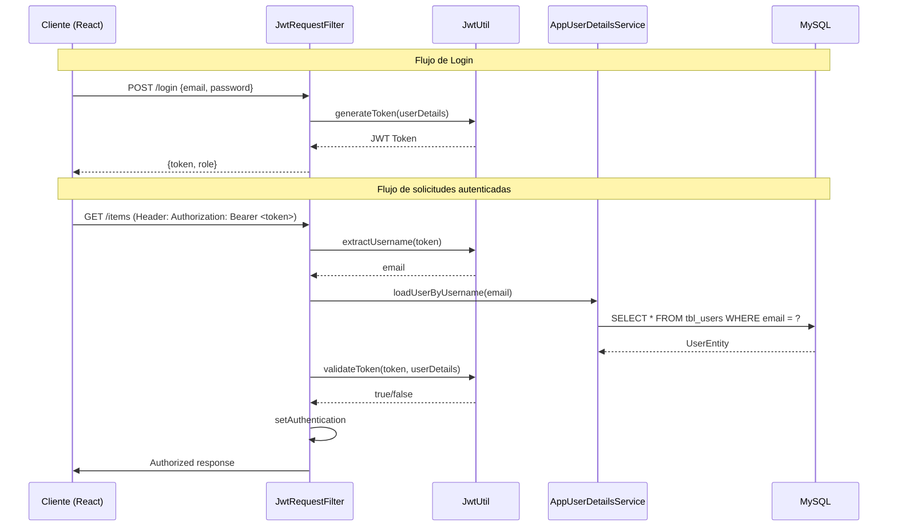

# Documentación de Seguridad y Autenticación JWT - Lunaria

## 1. Visión General

El sistema de Lunaria implementa un sistema de autenticación basado en **JWT (JSON Web Tokens)** para proteger los endpoints de la API REST. El sistema utiliza Spring Security junto con JWT para proporcionar autenticación stateless.

### 1.1 Componentes de Seguridad

| Componente | Archivo | Descripción |
|------------|---------|-------------|
| Utilidad JWT | `JwtUtil.java` | Generación y validación de tokens |
| Filtro JWT | `JwtRequestFilter.java` | Intercepta solicitudes y valida tokens |
| Servicio de Usuarios | `AppUserDetailsService.java` | Carga usuarios desde la base de datos |
| Configuración de Seguridad | `SecurityConfig.java` | Configura Spring Security |

---

## 2. Flujo de Autenticación



---

## 3. Configuración de Seguridad

### 3.1 SecurityConfig.java

```java
@Configuration
@EnableWebSecurity
@RequiredArgsConstructor
public class SecurityConfig {

    private final AppUserDetailsService appUserDetailsService;
    private final JwtRequestFilter jwtRequestFilter;

    @Bean
    public SecurityFilterChain securityFilterChain(HttpSecurity http) throws Exception {
        http.cors(Customizer.withDefaults())
                .csrf(AbstractHttpConfigurer::disable)
                .authorizeHttpRequests(auth -> auth
                    .requestMatchers("/login", "/register", "/encode", "/uploads/**", 
                                   "/swagger-ui/**", "/v3/api-docs/**")
                        .permitAll()
                    .requestMatchers("/categories", "/items", "/sales", "/payments", 
                                   "/dashboard", "/favorites/**")
                        .hasAnyRole("USER", "ADMIN")
                    .requestMatchers("/admin/**")
                        .hasRole("ADMIN")
                    .anyRequest().authenticated())
                .sessionManagement(session -> session
                    .sessionCreationPolicy(SessionCreationPolicy.STATELESS))
                .addFilterBefore(jwtRequestFilter, UsernamePasswordAuthenticationFilter.class);
        return http.build();
    }
}
```

---

## 4. Reglas de Autorización

### 4.1 Endpoints Públicos (Sin autenticación)

| Endpoint | Método | Descripción |
|----------|--------|-------------|
| `/login` | POST | Iniciar sesión |
| `/register` | POST | Registrar nuevo usuario |
| `/encode` | POST | Encriptar contraseña (dev) |
| `/uploads/**` | * | Archivos estáticos |
| `/swagger-ui/**` | * | Documentación API |
| `/v3/api-docs/**` | * | Especificación OpenAPI |

### 4.2 Endpoints para USER y ADMIN

| Endpoint | Método | Descripción |
|----------|--------|-------------|
| `/categories` | GET | Listar categorías |
| `/items` | GET | Listar productos |
| `/sales` | GET | Listar ventas |
| `/dashboard` | GET | Estadísticas |
| `/favorites/**` | * | Favoritos |

### 4.3 Endpoints Solo ADMIN

| Endpoint | Método | Descripción |
|----------|--------|-------------|
| `/admin/**` | * | Todas las operaciones de administración |

---

## 5. Implementación de JWT

### 5.1 JwtUtil.java

Utilidad para generar y validar tokens JWT.

```java
@Component
public class JwtUtil {

    @Value("${jwt.secret.key}")
    private String SECRET_KEY;

    // Genera un token JWT con el nombre de usuario
    public String generateToken(UserDetails userDetails) {
        Map<String, Object> claims = new HashMap<>();
        return createToken(claims, userDetails.getUsername());
    }

    // Crea el token conClaims, sujeto y expiración
    private String createToken(Map<String, Object> claims, String subject) {
        return Jwts.builder()
                .setClaims(claims)
                .setSubject(subject)
                .setIssuedAt(new Date(System.currentTimeMillis()))
                .setExpiration(new Date(System.currentTimeMillis() + 1000 * 60 * 60 * 10)) // 10 horas
                .signWith(SignatureAlgorithm.HS256, SECRET_KEY)
                .compact();
    }

    // Extrae el nombre de usuario del token
    public String extractUsername(String token) {
        return extractClaim(token, Claims::getSubject);
    }

    // Valida el token contra los detalles del usuario
    public Boolean validateToken(String token, UserDetails userDetails) {
        final String username = extractUsername(token);
        return (username.equals(userDetails.getUsername()) && !isTokenExpired(token));
    }
}
```

**Características del Token:**
- **Algoritmo**: HS256
- **Expiración**: 10 horas (configurable)
- **Sujeto**: Email del usuario

---

### 5.2 JwtRequestFilter.java

Filtro que intercepta cada solicitud HTTP.

```java
@Component
@RequiredArgsConstructor
public class JwtRequestFilter extends OncePerRequestFilter {

    private final AppUserDetailsService userDetailsService;
    private final JwtUtil jwtUtil;

    @Override
    protected void doFilterInternal(HttpServletRequest request, 
                                    HttpServletResponse response, 
                                    FilterChain filterChain) 
            throws ServletException, IOException {

        final String authorizationHeader = request.getHeader("Authorization");

        String email = null;
        String jwt = null;

        // Extrae el token del header "Bearer <token>"
        if (authorizationHeader != null && authorizationHeader.startsWith("Bearer ")) {
            jwt = authorizationHeader.substring(7);
            email = jwtUtil.extractUsername(jwt);
        }

        // Si hay email y no hay autenticación, valida el token
        if (email != null && SecurityContextHolder.getContext().getAuthentication() == null) {
            UserDetails userDetails = userDetailsService.loadUserByUsername(email);
            
            if (jwtUtil.validateToken(jwt, userDetails)) {
                UsernamePasswordAuthenticationToken authToken =
                        new UsernamePasswordAuthenticationToken(
                            userDetails, 
                            null, 
                            userDetails.getAuthorities());
                authToken.setDetails(new WebAuthenticationDetailsSource().buildDetails(request));
                SecurityContextHolder.getContext().setAuthentication(authToken);
            }
        }
        filterChain.doFilter(request, response);
    }
}
```

---

### 5.3 AppUserDetailsService.java

Carga usuarios desde la base de datos para autenticación.

```java
@Service
@RequiredArgsConstructor
public class AppUserDetailsService implements UserDetailsService {

    private final UserRepository userRepository;

    @Override
    public UserDetails loadUserByUsername(String email) throws UsernameNotFoundException {
        UserEntity existingUser = userRepository.findByEmail(email)
                .orElseThrow(() -> new UsernameNotFoundException("Email not found: " + email));
        
        return new User(
            existingUser.getEmail(), 
            existingUser.getPassword(), 
            Collections.singleton(new SimpleGrantedAuthority(existingUser.getRole()))
        );
    }
}
```

---

## 6. Configuración CORS

### 6.1 Orígenes Permitidos

```java
private UrlBasedCorsConfigurationSource corsConfigurationSource() {
    CorsConfiguration config = new CorsConfiguration();
    config.setAllowedOriginPatterns(List.of(
        "http://localhost:*",                    // Desarrollo local
        "http://192.168.*.*:*",                  // Red local
        "https://lunariav2-production.up.railway.app",  // Railway
        "https://*.vercel.app"                    // Vercel
    ));
    config.setAllowedMethods(List.of("GET", "POST", "PUT", "DELETE", "PATCH", "OPTIONS"));
    config.setAllowedHeaders(List.of("Authorization", "Content-Type"));
    config.setAllowCredentials(true);
    
    UrlBasedCorsConfigurationSource source = new UrlBasedCorsConfigurationSource();
    source.registerCorsConfiguration("/**", config);
    return source;
}
```

---

## 7. Roles y Permisos

### 7.1 Roles del Sistema

| Rol | Descripción | Permisos |
|-----|-------------|----------|
| `ROLE_ADMIN` | Administrador | Acceso completo a todos los endpoints |
| `ROLE_USER` | Usuario estándar | Acceso a endpoints de lectura y operaciones básicas |

### 7.2 Asignación de Roles

- **Registro**: Los nuevos usuarios se registran con `ROLE_USER` por defecto.
- **Edición**: Un administrador puede cambiar roles mediante `PUT /admin/users/{userId}`.

---

## 8. Encriptación de Contraseñas

### 8.1 BCrypt

El sistema utiliza **BCrypt** para encriptar contraseñas:

```java
@Bean
public PasswordEncoder passwordEncoder() {
    return new BCryptPasswordEncoder();
}
```

**Características:**
- Sal automática
- Costo de procesamiento configurable
- Almacenamiento seguro en la base de datos

---

## 9. Configuración de Variables de Entorno

### 9.1 Variables de Seguridad

| Variable | Descripción | Valor por defecto |
|----------|-------------|-------------------|
| `JWT_SECRET_KEY` | Clave secreta para JWT | `lunaria_secret_key_please_change_in_production_minimum_256_bits_required` |

**⚠️ Nota de Seguridad**: En producción, cambiar la clave JWT a un valor seguro de al menos 256 bits.

---

## 10. Manejo de Errores

### 10.1 Respuestas de Error

| Código | Descripción |
|--------|-------------|
| 400 | Credenciales inválidas |
| 401 | No autorizado (token inválido o faltante) |
| 403 | Prohibido (sin permisos suficientes) |
| 404 | Recurso no encontrado |

### 10.2 Ejemplo de Error de Login

```json
// POST /login con credenciales incorrectas
{
    "status": 400,
    "error": "Bad Request",
    "message": "Email or password is incorrect"
}
```

---

## 11. Best Practices Implementadas

1. **Stateless**: No se almacenan sesiones en el servidor
2. **Contraseñas encriptadas**: BCrypt con salt
3. **CORS configurado**: Solo orígenes específicos
4. **CSRF deshabilitado**: API REST stateless
5. **Expiración de tokens**: 10 horas
6. **Separación de roles**: USER y ADMIN

---

*Documento generado para el proyecto Lunaria v2*
*Seguridad: Spring Security + JWT*
