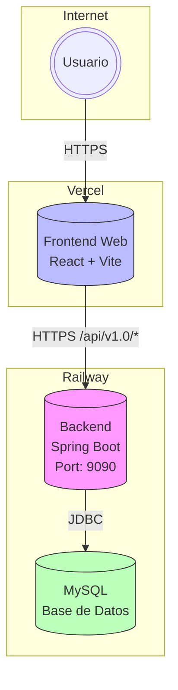
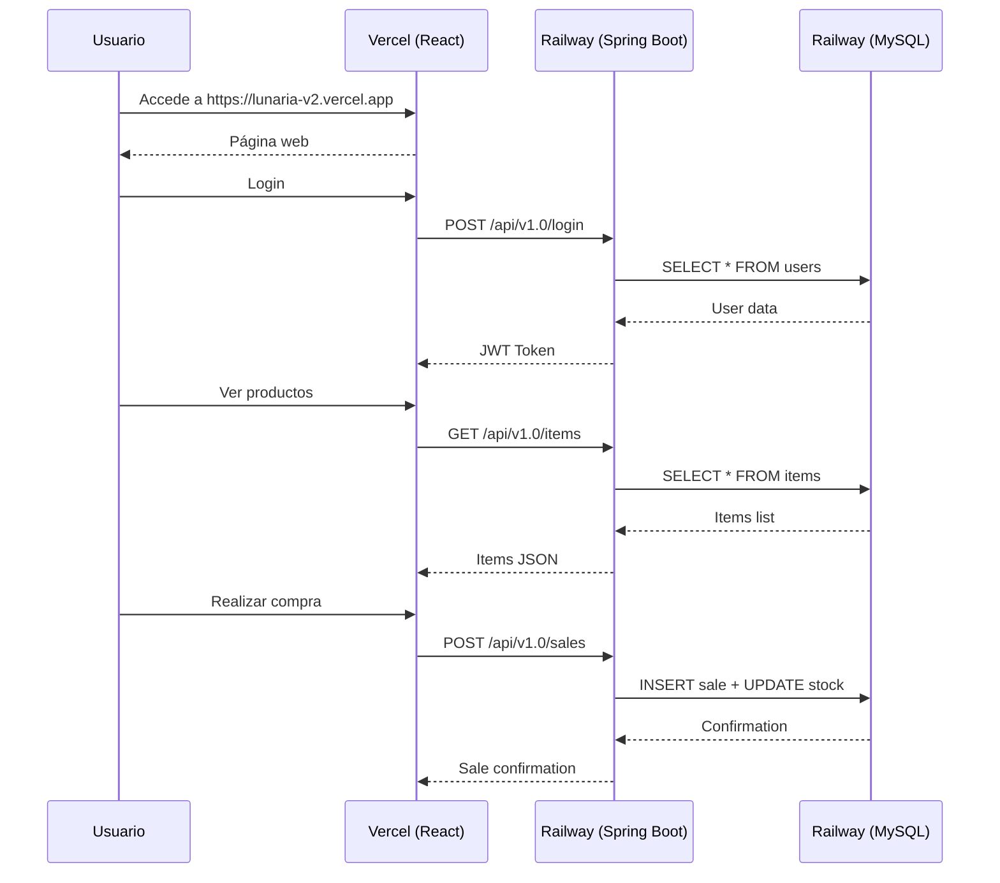

# Documentación de Despliegue - Lunaria

## 1. Visión General

El proyecto Lunaria se despliega en dos plataformas cloud:

| Componente | Plataforma | URL Production |
|------------|------------|----------------|
| Backend | Railway | `https://lunariav2-production.up.railway.app` |
| Frontend Web | Vercel | `https://lunaria-v2.vercel.app` |
| Base de Datos | Railway (MySQL) | - |

---

## 2. Arquitectura de Despliegue



---

## 3. Despliegue del Backend (Railway)

### 3.1 Configuración de Railway

```json
// railway.json
{
    "$schema": "https://railway.app/railway.schema.json",
    "build": {
        "builder": "DOCKERFILE",
        "dockerfilePath": "03_backend/lunaria-backend-springboot/Dockerfile"
    },
    "deploy": {
        "numReplicas": 1,
        "restartPolicyType": "ON_FAILURE",
        "restartPolicyMaxRetries": 10
    }
}
```

### 3.2 Dockerfile

```dockerfile
# Build stage
FROM eclipse-temurin:17-jdk AS build
WORKDIR /app
RUN apt-get update && apt-get install -y maven
COPY pom.xml .
RUN mvn dependency:go-offline -B
COPY src ./src
RUN mvn clean package -DskipTests

# Runtime stage
FROM eclipse-temurin:17-jre
WORKDIR /app
COPY --from=build /app/target/*.jar app.jar
EXPOSE 9090
ENTRYPOINT ["java", "-jar", "app.jar"]
```

### 3.3 Variables de Entorno (Railway)

| Variable | Valor | Descripción |
|----------|-------|-------------|
| `SERVER_PORT` | `9090` | Puerto del servidor |
| `SPRING_DATASOURCE_URL` | URL de MySQL Railway | Connection string |
| `SPRING_DATASOURCE_USERNAME` | Usuario MySQL | - |
| `SPRING_DATASOURCE_PASSWORD` | Contraseña MySQL | - |
| `JWT_SECRET_KEY` | Clave segura | Clave JWT en producción |
| `APP_SERVER_URL` | `https://lunariav2-production.up.railway.app` | URL del servidor |

### 3.4 Configuración CORS

El backend está configurado para aceptar solicitudes desde:

```java
config.setAllowedOriginPatterns(List.of(
    "http://localhost:*",
    "http://192.168.*.*:*",
    "https://lunariav2-production.up.railway.app",
    "https://*.vercel.app"
));
```

---

## 4. Despliegue del Frontend (Vercel)

### 4.1 Configuración de Vercel

```json
// vercel.json
{
    "rewrites": [
        { "source": "/(.*)", "destination": "/" }
    ]
}
```

### 4.2 Variables de Entorno (Vercel)

| Variable | Valor | Descripción |
|----------|-------|-------------|
| `VITE_API_URL` | `https://lunariav2-production.up.railway.app/api/v1.0` | URL del backend |

### 4.3 Configuración de Production

```env
# .env.production
VITE_API_URL=https://lunariav2-production.up.railway.app/api/v1.0
```

---

## 5. Pasos de Despliegue

### 5.1 Desplegar Backend en Railway

1. **Crear proyecto en Railway**
   - Ir a [Railway](https://railway.app)
   - Crear nuevo proyecto
   - Agregar plugin MySQL

2. **Configurar variables de entorno**
   - Agregar las variables de entorno necesarias
   - Obtener la URL de MySQL del plugin

3. **Conectar repositorio**
   - Conectar con GitHub
   - Seleccionar el repositorio

4. **Deploy**
   - Railway detectará automáticamente el `railway.json`
   - Construirá usando el Dockerfile
   - Desplegará la aplicación

### 5.2 Desplegar Frontend en Vercel

1. **Crear proyecto en Vercel**
   - Ir a [Vercel](https://vercel.com)
   - Importar desde GitHub

2. **Configurar**
   - Framework preset: Vite
   - Root directory: `04_frontend_web/lunaria-frontend-react`

3. **Variables de entorno**
   - Agregar `VITE_API_URL` con la URL de Railway

4. **Deploy**
   - Vercel construirá automáticamente
   - Desplegará en la URL proporcionada

---

## 6. URLs de Producción

| Servicio | URL |
|----------|-----|
| Frontend | `https://lunaria-v2.vercel.app` |
| Backend API | `https://lunariav2-production.up.railway.app/api/v1.0` |
| Swagger UI | `https://lunariav2-production.up.railway.app/api/v1.0/swagger-ui/index.html` |

---

## 7. Mantenimiento

### 7.1 Actualizar Backend

1. Hacer cambios en el código
2. Commit y push a GitHub
3. Railway detectará automáticamente los cambios
4. Realizará el deploy automáticamente

### 7.2 Actualizar Frontend

1. Hacer cambios en el código
2. Commit y push a GitHub
3. Vercel detectará automáticamente los cambios
4. Realizará el deploy automáticamente

### 7.3 Variables de Entorno Sensibles

| Variable | Acción Requerida |
|----------|-------------------|
| `JWT_SECRET_KEY` | Cambiar en producción a un valor seguro |
| `SPRING_DATASOURCE_PASSWORD` | Mantener en secrets de Railway |
| `AWS_ACCESS_KEY` | Solo si se usa S3 |
| `AWS_SECRET_KEY` | Solo si se usa S3 |

---

## 8. Troubleshooting

### 8.1 Problemas Comunes

| Problema | Solución |
|----------|----------|
| CORS errors | Verificar que la URL del frontend esté en `allowedOrigins` |
| 500 Error en API | Ver logs en Railway |
| Base de datos no conecta | Verificar credenciales en variables de entorno |
| Imágenes no cargan | Verificar configuración de AWS S3 |

### 8.2 Ver Logs

**Railway:**
- Dashboard → Deploy → View Logs

**Vercel:**
- Dashboard → Deployment → Logs

---

## 9. Diagrama de Flujo de Datos



---

## 10. Recursos Adicionales

| Recurso | URL |
|---------|-----|
| Dashboard Railway | https://railway.app |
| Dashboard Vercel | https://vercel.com |
| Documentación Railway | https://docs.railway.app |
| Documentación Vercel | https://vercel.com/docs |

---

*Documento generado para el proyecto Lunaria v2*
*Despliegue: Railway + Vercel*
