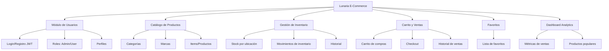
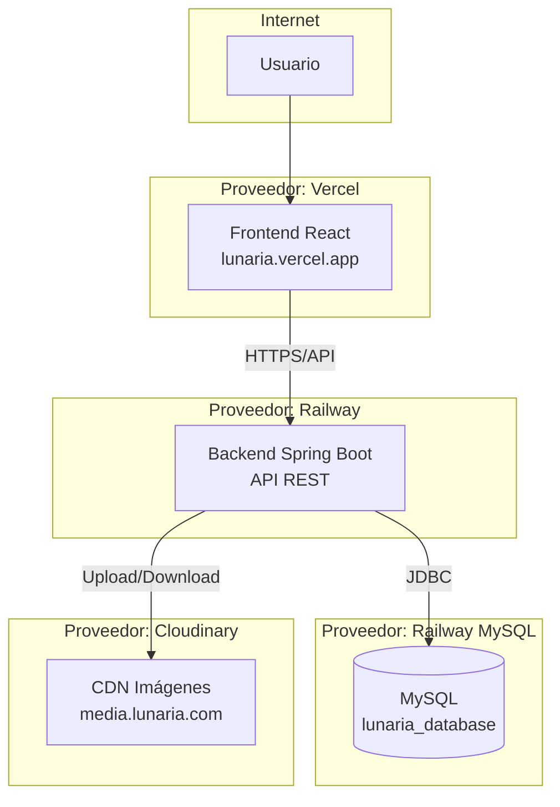

# Análisis del Proyecto Lunaria - Opciones de Despliegue

## 1. Resumen Ejecutivo del Proyecto

**Lunaria** es una aplicación de comercio electrónico (POS - Point of Sale) con gestión de inventario, desarrollada como proyecto académico con tecnologías modernas full-stack.

---

## 2. Tecnologías Utilizadas

### Backend
| Tecnología | Versión | Propósito |
|------------|---------|-----------|
| Spring Boot | 3.4.4 | Framework principal |
| Java | 17 | Lenguaje de programación |
| Spring Data JPA | - | ORM y acceso a datos |
| MySQL | 8.0+ | Base de datos relacional |
| Spring Security | - | Autenticación y autorización |
| JWT (jjwt) | 0.9.1 | Tokens de autenticación |
| AWS SDK S3 | 2.30.31 | Almacenamiento de imágenes |
| Cloudinary | 1.38.0 | CDN para imágenes |
| SpringDoc OpenAPI | 2.7.0 | Documentación API (Swagger) |
| Lombok | 1.18.36 | Reducción de boilerplate |
| Selenium | 4.18.1 | Pruebas automatizadas |

### Frontend Web
| Tecnología | Versión | Propósito |
|------------|---------|-----------|
| React | 19.0.0 | Framework UI |
| Vite | 6.2.0 | Build tool y dev server |
| Bootstrap | 5.3.3 | Framework CSS |
| Bootstrap Icons | 1.11.3 | Iconos |
| React Router DOM | 7.4.1 | Enrutamiento |
| Axios | 1.8.4 | Cliente HTTP |
| React Hot Toast | 2.5.2 | Notificaciones |

### Frontend Mobile
| Tecnología | Propósito |
|------------|-----------|
| Flutter | App móvil multiplataforma |

---

## 3. Funcionalidades del Sistema

### Módulos Implementados



### Entidades de Base de Datos

- **Users** - Usuarios del sistema (roles: ADMIN, USER)
- **Categories** - Categorías de productos
- **Brands** - Marcas de productos
- **Items** - Productos/items del inventario
- **Sales** - Registro de ventas
- **SaleItems** - Items vendidos en cada venta
- **StockMovements** - Historial de cambios de inventario
- **Favorites** - Productos favoritos por usuario

---

## 4. Estado Actual del Proyecto

### Componentes Listos para Producción

| Componente | Estado | Notas |
|------------|--------|-------|
| Backend Spring Boot | ✅ Listo | Configurado para Railway |
| Frontend React | ✅ Listo | Configurado para Vercel |
| Base de Datos MySQL | ⚠️ Pendiente | Necesita servicio externo |
| Almacenamiento Imágenes | ✅ Cloudinary | Implementado |
| Autenticación JWT | ✅ Listo | Configurable via variables |

### Configuración de Variables de Entorno

**Backend (Railway):**
```
SPRING_DATASOURCE_URL=jdbc:mysql://host:3306/lunaria_database
SPRING_DATASOURCE_USERNAME=root
SPRING_DATASOURCE_PASSWORD=***
JWT_SECRET_KEY=***
CLOUDINARY_CLOUD_NAME=***
CLOUDINARY_API_KEY=***
CLOUDINARY_API_SECRET=***
APP_SERVER_URL=https://tu-dominio.com
```

**Frontend (Vercel):**
```
VITE_API_URL=https://tu-backend.up.railway.app/api/v1.0
```

---

## 5. Alternativas de Despliegue a Corto Plazo

### Opción A: Railway + Vercel (Recomendada para inicio rápido)

| Servicio | Costo Inicial | Notes |
|----------|---------------|-------|
| Railway Backend | $5/mes | Instancia dedicada |
| Railway MySQL | $5/mes | 100MB gratuito |
| Vercel Frontend | Gratis | Hasta 100GB/mes |
| Cloudinary | Gratis | 25GB bandwidth |

**Pros:**
- Despliegue rápido
- Integración con GitHub
- SSL automático

**Contras:**
- Costos mensuales mínimos ~$10
- Railway puede hibernar en plan gratuito

---

### Opción B: Render + Railway MySQL

| Servicio | Costo Inicial |
|----------|---------------|
| Render Backend | Gratis (con hibernación) |
| Railway MySQL | $5/mes |
| Vercel Frontend | Gratis |

---

### Opción C: Fly.io + Supabase

| Servicio | Costo Inicial |
|----------|---------------|
| Fly.io Backend | $5/mes |
| Supabase (PostgreSQL) | Gratis |
| Vercel Frontend | Gratis |

---

### Opción D: AWS (Escalable pero complejo)

| Servicio | Costo Estimado |
|----------|----------------|
| EC2 (t3.micro) | ~$10/mes |
| RDS MySQL | ~$15/mes |
| S3 (imágenes) | ~$5/mes |
| CloudFront CDN | ~$5/mes |

---

## 6. Arquitectura de Despliegue Recomendada



---

## 7. Plan de Despliegue Inmediato

### Paso 1: Base de Datos MySQL
- [ ] Crear servicio MySQL en Railway
- [ ] Obtener connection string
- [ ] Importar schema desde `02_database/lunaria_database.sql`

### Paso 2: Backend
- [ ] Configurar variables en Railway
- [ ] Desplegar desde GitHub (rama principal)
- [ ] Verificar health endpoint

### Paso 3: Frontend
- [ ] Conectar con Vercel
- [ ] Configurar VITE_API_URL
- [ ] Desplegar automáticamente

### Paso 4: Verificación
- [ ] Probar login
- [ ] Probar upload de imágenes
- [ ] Probar flujo de compra

---

## 8. Recomendación Final

**Para corto plazo (inmediatez):** Usar **Railway + Vercel** con MySQL en Railway. La ventaja es que todo está centralizado y la integración es muy simple.

**Para escalabilidad futura:** Considerar migrar a **AWS (EC2 + RDS + S3)** cuando el tráfico aumente significativamente.

El proyecto ya tiene el código preparado para despliegue. Solo falta configurar las variables de entorno y conectar los servicios.

---

*Documento generado para planificación de despliegue*
*Fecha: 2026-02-25*
