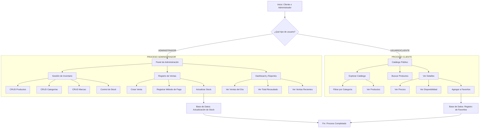
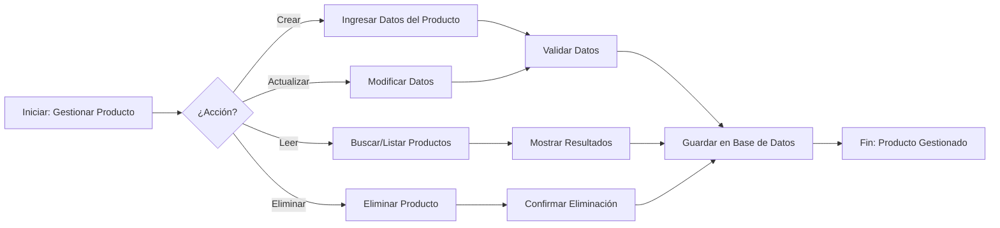
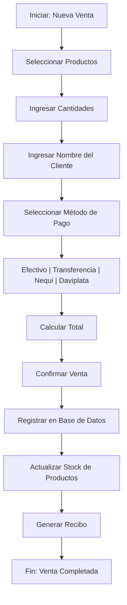
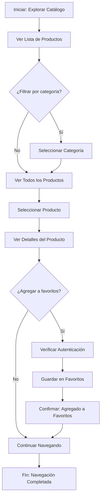
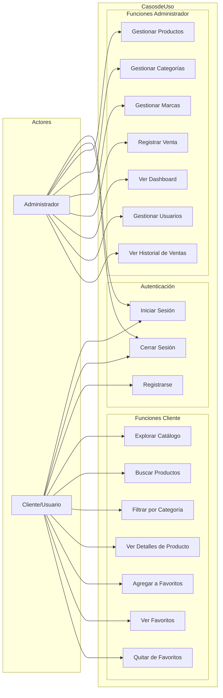
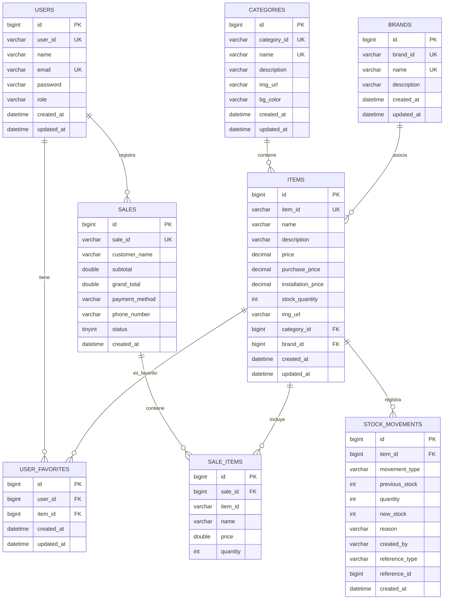
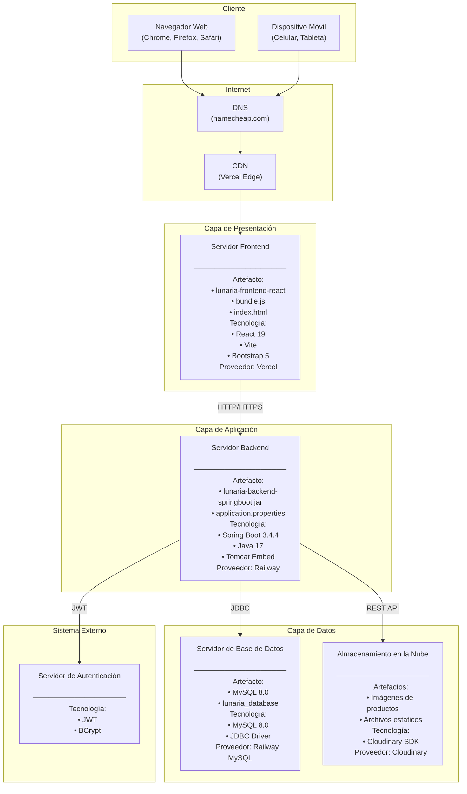
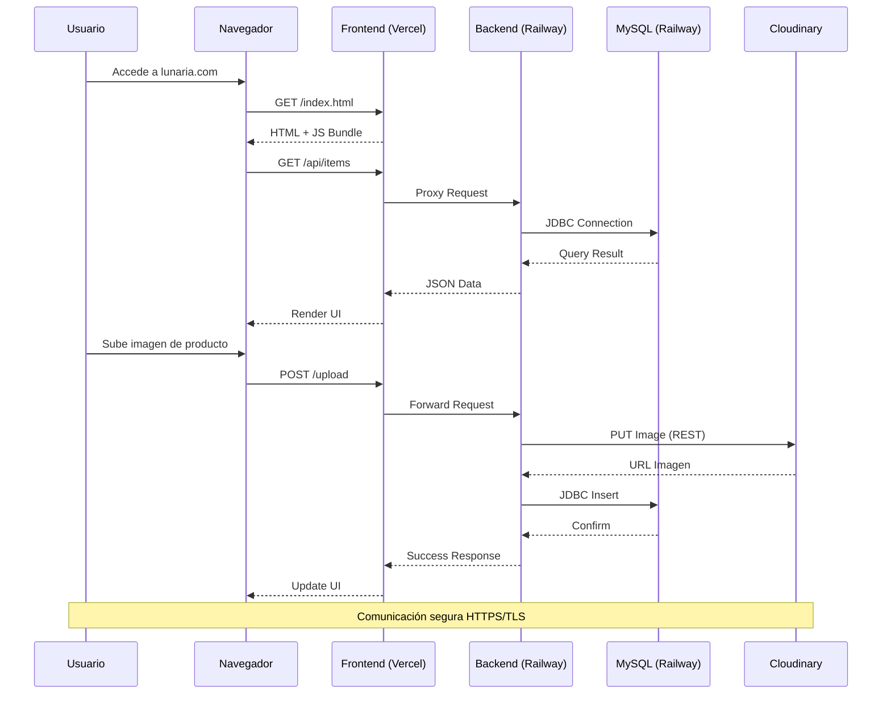
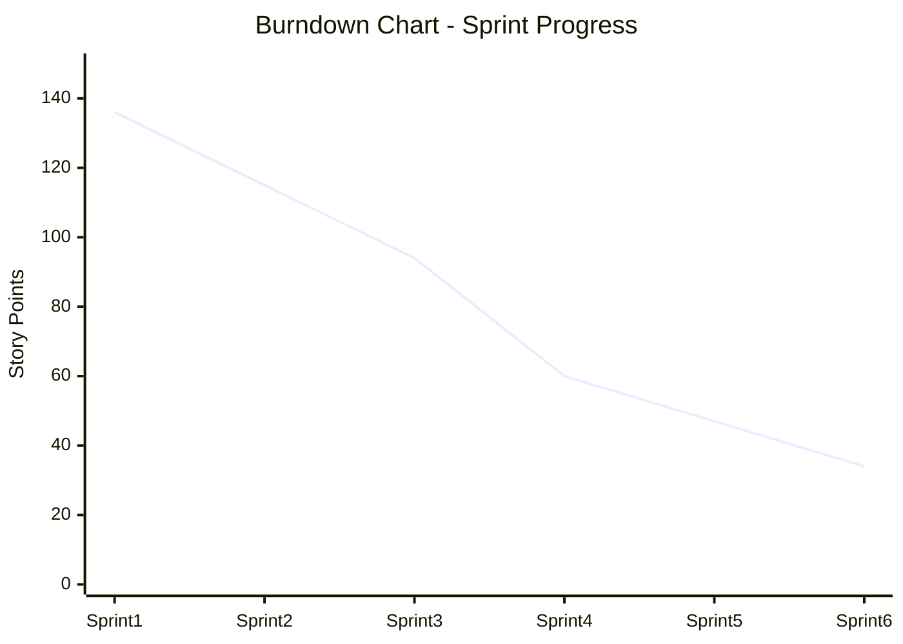

# Documentación del Proyecto: Lunaria

---

## 1. Nombre del Proyecto

**Lunaria** - Sistema de Gestión Comercial para Talleres Automotrices

---

## 2. Planteamiento del Problema

Los talleres automotrices y negocios de venta de repuestos enfrentan múltiples desafíos en la gestión diaria de sus operaciones:

### Problemas Identificados:

1. **Gestión Manual de Inventario**: Los registros de productos, precios y existencias se llevan de manera manual o en hojas de cálculo, propensos a errores y difíciles de actualizar.

2. **Falta de Control de Ventas**: Sin un sistema centralizado, es difícil rastrear las ventas diarias, identificar productos populares y generar reportes financieros.

3. **Dificultad para Gestionar Clientes**: No existe un registro estructurado de clientes ni возможность de ofrecerles un catálogo digital para browsing de productos.

4. **Sin Sistema de Favoritos**: Los clientes potenciales no pueden guardar productos de interés para futura referencia, lo que reduce las oportunidades de venta.

5. **Gestión de Marcas y Categorías**: La organización de productos por categorías y marcas se vuelve caótica sin una herramienta dedicada.

6. **Control de Stock Limitado**: No hay visibilidad en tiempo real de qué productos están en stock, stock bajo o agotados.

---

## 3. Justificación

El desarrollo de **Lunaria** se justifica por las siguientes razones:

### Justificación Técnica:
- **Tecnologías Modernas**: Utiliza un stack tecnológico robusto (Spring Boot, React, MySQL) que garantiza escalabilidad y mantenimiento a largo plazo.
- **Arquitectura Separada**: La分离 de backend y frontend permite actualizaciones independientes y mejor mantenibilidad.
- **Seguridad**: Implementa JWT para autenticación segura y control de acceso basado en roles.

### Justificación Operativa:
- **Automatización**: Elimina procesos manuales prone a errores.
- **Toma de Decisiones**: Proporciona dashboard con métricas en tiempo real.
- **Experiencia de Usuario**: Interfaz responsiva que funciona en dispositivos móviles y escritorio.

### Justificación Comercial:
- **Reducción de Costos**: Elimina la necesidad de software comercial costoso.
- **Accesibilidad**: Los clientes pueden acceder al catálogo desde cualquier lugar.
- **Competitividad**: Posiciona al negocio como una empresa tecnológicamente actualizada.

---

## 4. Pregunta del Proyecto

**¿Cómo puede un sistema web integrado mejorar la gestión comercial de un taller automotriz, permitiendo el control centralizado de inventario, ventas y clientes, mientras ofrece una experiencia de compra moderna a los clientes?**

---

## 5. Objetivo General

Desarrollar e implementar un sistema de gestión comercial web llamado **Lunaria** que permita a talleres automotrices y negocios de repuestos administrar de manera eficiente su inventario de productos, controlar las ventas, gestionar clientes y ofrecer un catálogo digital accesible, utilizando tecnologías modernas de desarrollo web que garanticen escalabilidad, seguridad y facilidad de uso tanto para administradores como para clientes finales.

---

## 6. Objetivos Específicos

### 6.1 Gestión de Inventario
- Desarrollar módulos CRUD (Crear, Leer, Actualizar, Eliminar) para productos, categorías y marcas.
- Implementar control de stock con estados: En Stock, Stock Bajo, Sin Stock.
- Gestionar múltiples precios por producto: precio de venta, precio con instalación, precio de compra.

### 6.2 Control de Ventas
- Crear sistema de registro de ventas con detalles completos.
- Implementar múltiples métodos de pago (Efectivo, Transferencia, Nequi, Daviplata).
- Generar dashboard con métricas: ventas del día,total recaudado, ventas recientes.

### 6.3 Gestión de Usuarios
- Implementar autenticación segura con JWT.
- Definir roles: ADMIN (administradores) y USER (clientes).
- Controlar acceso a funcionalidades según rol del usuario.

### 6.4 Catálogo Digital
- Desarrollar interfaz de exploración de productos filtrable por categoría.
- Implementar sistema de favoritos para que clientes guarden productos de interés.
- Mostrar información detallada de productos incluyendo precios y disponibilidad.

### 6.5 Interfaz Responsiva
- Diseñar interfaz que funcione correctamente en dispositivos móviles y escritorio.
- Asegurar navegación fluida y experiencia de usuario intuitiva.

### 6.6 Despliegue y Mantenimiento
- Configurar despliegue en servidores externos (Railway, Vercel).
- Implementar almacenamiento de imágenes en la nube (Cloudinary).

---

## 7. Alcance del Proyecto

### 7.1 Funcionalidades Incluidas

| Módulo | Funcionalidades |
|--------|-----------------|
| **Autenticación** | Login, Registro, Logout, JWT |
| **Administración** | Dashboard con métricas, Gestión de usuarios (Admin) |
| **Inventario** | CRUD Productos, CRUD Categorías, CRUD Marcas, Control de Stock |
| **Ventas** | Registro de ventas, Historial de ventas, Métodos de pago |
| **Catálogo** | Exploración de productos, Búsqueda, Filtrado por categoría |
| **Favoritos** | Agregar/Quitar favoritos, Ver lista de favoritos |
| **Imágenes** | Upload de imágenes, Almacenamiento en Cloudinary |

### 7.2 Roles de Usuario

| Rol | Permisos |
|-----|----------|
| **ADMIN** | Gestión completa de inventario, ventas, usuarios, categorías, marcas |
| **USER** | Explorar catálogo, agregar a favoritos, realizar compras |

### 7.3 Tecnologías Utilizadas

#### Backend:
- **Framework**: Spring Boot 3.4.4
- **Lenguaje**: Java 17
- **Base de Datos**: MySQL (Railway)
- **Autenticación**: JWT (JSON Web Tokens)
- **API**: RESTful con OpenAPI/Swagger

#### Frontend:
- **Framework**: React 19
- **Build Tool**: Vite
- **Estilos**: Bootstrap 5, CSS personalizado
- **Routing**: React Router v6

#### Infraestructura:
- **Hosting Backend**: Railway
- **Hosting Frontend**: Vercel
- **Almacenamiento de Imágenes**: Cloudinary

### 7.4 Módulos del Sistema

```
Lunaria/
├── 02_database/          # Scripts de base de datos
├── 03_backend/           # API REST con Spring Boot
│   └── lunaria-backend-springboot/
│       ├── src/main/java/
│       │   ├── config/      # Configuraciones (Security, AWS, OpenAPI)
│       │   ├── controller/  # Controladores REST
│       │   ├── entity/      # Entidades JPA
│       │   ├── io/          # DTOs (Request/Response)
│       │   ├── repository/ # Repositorios JPA
│       │   ├── service/     # Lógica de negocio
│       │   └── filter/      # Filtros JWT
├── 04_frontend_web/      # Aplicación React
│   └── lunaria-frontend-react/
│       └── src/
│           ├── components/  # Componentes reutilizables
│           ├── pages/       # Páginas principales
│           ├── context/     # Estado global (React Context)
│           └── Service/     # Servicios API
└── plans/                 # Documentación
```

### 7.5 Entidades Principales

| Entidad | Descripción |
|---------|-------------|
| **User** | Usuarios del sistema (admin y clientes) |
| **Item** | Productos del inventario |
| **Category** | Categorías de productos |
| **Brand** | Marcas de productos |
| **Sale** | Registro de ventas |
| **SaleItem** | Items vendidos en una venta |
| **Favorite** | Productos favoritos de usuarios |
| **StockMovement** | Historial de cambios de stock |

### 7.6 Limitaciones del Proyecto

- No incluye pasarela de pagos online (solo registro de método de pago).
- No maneja facturación electrónica.
- No incluye módulo de proveedores.
- No contempla múltiples bodegas.

---

## 8. Conclusión

**Lunaria** representa una solución integral para la gestión comercial de talleres automotrices, abordando las necesidades fundamentales de inventario, ventas y atención al cliente. El proyecto demuestra competencia en desarrollo full-stack con tecnologías modernas y proporciona una base sólida para futuras expansiones.

---

## 9. Diagrama de Procesos

### Macroproceso: Gestión Comercial de Lunaria



### Subproceso 1: Gestión de Inventario



### Subproceso 2: Proceso de Venta



### Subproceso 3: Catálogo y Favoritos



---

## 10. Metodología de Investigación

### 10.1 Técnicas de Recolección de Datos

Para el desarrollo del proyecto se utilizó una combinación de técnicas de recolección de información:

| Técnica | Descripción | Aplicación en el Proyecto |
|---------|-------------|--------------------------|
| **Entrevista** | Comunicación directa con el usuario final | Entrevista al propietario del negocio |
| **Observación Directa** | Visita al taller para identificar procesos | Análisis del flujo de trabajo |
| **Revisión Documental** | Análisis de métodos actuales de gestión | Evaluación de sistemas manuales |

---

## 11. Análisis de Entrevista: Caso "Bicicletería Rodadas del Valle"

### 11.1 Datos del Entrevistado

| Campo | Información |
|-------|-------------|
| **Nombre** | Carlos Mendoza Pérez |
| **Cargo** | Propietario y Administrador |
| **Negocio** | Bicicletería "Rodadas del Valle" |
| **Tiempo en el negocio** | 8 años |
| **Ubicación** | Zona urbana, ciudad de referencia |

### 11.2 Contexto del Negocio

La bicicletería "Rodadas del Valle" es un pequeño negocio familiar especializado en:
- Venta de bicicletas nuevas y usadas
- Repuestos y accesorios para bicicletas
- Servicio de reparaciones y mantenimiento
- Venta de instalación de componentes

El negocio atiende aproximadamente entre 15 a 25 clientes diarios en temporada alta.

### 11.3 Transcripción de Entrevista

**Entrevistador:** Buenos días, Carlos. Gracias por concedernos esta entrevista. Nos gustaría entender los desafíos que enfrenta en la gestión de su bicicletería.

**Carlos Mendoza:** Buenos días, con gusto. Sí, les puedo contar que el manejo de todo esto se me ha salido de las manos con el tiempo. Empecé solo con una bitácora donde anotaba las ventas, pero ahora es un caos.

**Entrevistador:** ¿Podría describirnos cuáles son los principales problemas que enfrenta actualmente?

**Carlos Mendoza:** Mira, el problema más grande es el inventario. Tengo más de 500 artículos diferentes entre repuestos, accesorios, cámaras,链条, etc. Antes lo llevaba en un cuaderno, después en Excel, pero se medaña la información, se borra, o simplemente no me da tiempo de actualizarlo. El otro día un cliente me preguntó por un repuesto específico y le dije que sí tenía, pero cuando fui a buscarlo no estaba. Eso me ha hecho perder clientes.

**Entrevistador:** ¿Eso ha afectado su relación con los clientes?

**Carlos Mendoza:** Sí, bastante. Además, los clientes Often me preguntan qué productos tengo disponibles, si tengo de cierta marca, y tengo que entrar al cuarto a revisar todo manualmente. Muchos de mis clientes jóvenes me dicen que debería tener una "página" donde puedan ver lo que vendo, pero no tengo tiempo ni conocimiento para hacer eso.

**Entrevistador:** ¿Cómo maneja actualmente el registro de ventas?

**Carlos Mendoza:** Anoto las ventas en una libreta al final del día, pero muchas veces se me olvida o simplemente no me da tiempo. No sé exactamente cuánto vendo al día, cuánto gano. Pago mis impuestos estimando, pero no tengo datos reales. El mes pasado descubrí que había productos que vendí y nunca registré el ingreso.

**Entrevistador:** ¿Utiliza algún sistema actualmente?

**Carlos Mendoza:** Nada más Excel y WhatsApp para comunicarme con clientes. Les mando fotos de productos por WhatsApp, pero después se pierde el seguimiento de quién estaba interesado en qué. Me gustaría poder guardar esos productos como "favoritos" o algo así para no perder la venta.

**Entrevistador:** ¿Cuántas personas trabajan en el negocio?

**Carlos Mendoza:** Tengo dos empleados además de mí. Mi hijo mayor me ayuda los fines de semana. Pero ninguno sabe usar sistemas complicados. Necesitaría algo muy fácil, que se abriera en el celular.

**Entrevistador:** ¿Qué funcionalidades serían prioritarias para usted?

**Carlos Mendoza:** 
1. **Control de inventario** - Saber exactamente qué tengo y cuánto me queda
2. **Registro rápido de ventas** - Algo que no me quite mucho tiempo
3. **Catálogo digital** - Que mis clientes puedan ver lo que tengo sin necesidad de venir
4. **Control destock** - Que me avise cuando algo se esté agotando
5. **Reporte de ventas** - Saber cuánto he vendido y cuánto he ganado

**Entrevistador:** ¿Estaría dispuesto a implementar un sistema digital?

**Carlos Mendoza:** Totalmente. Creo que es necesario para no perder más clientes y para poder competir con las tiendas grandes que ya tienen todo digitalizado. Solo necesito que sea fácil de usar porque no soy bueno con la tecnología.

### 11.4 Análisis Cualitativo de la Entrevista

#### Temas Principales Identificados:

| Categoría | Problema Identificado | Frecuencia | Impacto |
|-----------|---------------------|------------|----------|
| Inventario | Falta de control y actualización | Alta | Crítico |
| Ventas | Registro manual propenso a errores | Alta | Alto |
| Clientes | Sin seguimiento de intereses | Media | Medio |
| Información | Ausencia de reportes y métricas | Alta | Alto |
| Usabilidad | Necesidad de sistema fácil de usar | Alta | Crítico |

#### Hallazgos Clave:

1. **Pérdida de ventas por información desactualizada**: El propietario no puede confiar en sus registros, lo que genera situaciones incómodas con clientes y pérdida de ventas.

2. **Ineficiencia en atención al cliente**: La falta de un catálogo digital obliga a loses clientes a visitar físicamente el negocio para verificar disponibilidad.

3. **Dificultad para tomar decisiones**: Sin datos reales de ventas, es imposible hacer planificación financiera o identificar productos populares.

4. **Dependencia de procesos manuales**: El uso de cuadernos y Excel no es escalable y propicia errores.

5. **Necesidad de simplicidad**: Cualquier solución debe ser fácil de usar, ya que ni el propietario ni sus empleados son expertos en tecnología.

#### Propuesta de Solución Basada en la Entrevista:

A partir de las necesidades expresadas por el señor Carlos Mendoza, se propone el desarrollo de **Lunaria**, un sistema que incluya:

- ✅ Módulo de inventario con control de stock en tiempo real
- ✅ Registro de ventas rápido e intuitivo
- ✅ Catálogo digital accesible para clientes
- ✅ Sistema de favoritos para seguimiento de intereses de clientes
- ✅ Dashboard con métricas y reportes de ventas
- ✅ Interfaz responsiva que funcione en celulares
- ✅ Roles de usuario: Administrador y Cliente

---

## 12. Specification de Requisitos (IEEE 29148:2018)

### 12.1 Requisitos Funcionales

Los requisitos funcionales describen las funciones y servicios que el sistema debe proporcionar.

#### RF-001: Autenticación de Usuarios

| ID | Requisito | Descripción |
|----|-----------|-------------|
| RF-001.1 | Inicio de Sesión | El sistema debe permitir a los usuarios autenticarse mediante nombre de usuario y contraseña |
| RF-001.2 | Cierre de Sesión | El sistema debe permitir cerrar sesión de forma segura |
| RF-001.3 | Registro de Usuarios | El sistema debe permitir el registro de nuevos usuarios clientes |
| RF-001.4 | Control de Acceso | El sistema debe restringir el acceso según el rol del usuario (ADMIN/USER) |

#### RF-002: Gestión de Productos (Inventario)

| ID | Requisito | Descripción |
|----|-----------|-------------|
| RF-002.1 | Crear Producto | El administrador debe poder crear nuevos productos con nombre, descripción, precio, categoría, marca, imagen y stock |
| RF-002.2 | Listar Productos | El sistema debe mostrar una lista de todos los productos disponibles |
| RF-002.3 | Editar Producto | El administrador debe poder modificar los datos de cualquier producto |
| RF-002.4 | Eliminar Producto | El administrador debe poder eliminar productos del inventario |
| RF-002.5 | Gestión de Imágenes | El sistema debe permitir subir y almacenar imágenes de productos |
| RF-002.6 | Múltiples Precios | El sistema debe gestionar precio de venta, precio con instalación y precio de compra |

#### RF-002.7 | Control de Stock | El sistema debe mostrar el estado del stock: En Stock, Stock Bajo, Sin Stock |

#### RF-003: Gestión de Categorías

| ID | Requisito | Descripción |
|----|-----------|-------------|
| RF-003.1 | Crear Categoría | El administrador debe poder crear nuevas categorías |
| RF-003.2 | Listar Categorías | El sistema debe mostrar todas las categorías disponibles |
| RF-003.3 | Editar Categoría | El administrador debe poder modificar categorías existentes |
| RF-003.4 | Eliminar Categoría | El administrador debe poder eliminar categorías |

#### RF-004: Gestión de Marcas

| ID | Requisito | Descripción |
|----|-----------|-------------|
| RF-004.1 | CRUD Marcas | El administrador debe poder crear, leer, actualizar y eliminar marcas de productos |

#### RF-005: Proceso de Ventas

| ID | Requisito | Descripción |
|----|-----------|-------------|
| RF-005.1 | Registrar Venta | El sistema debe permitir registrar una nueva venta con productos, cantidades y cliente |
| RF-005.2 | Métodos de Pago | El sistema debe soportar múltiples métodos de pago (Efectivo, Transferencia, Nequi, Daviplata) |
| RF-005.3 | Actualizar Stock | El sistema debe reducir automáticamente el stock al registrar una venta |
| RF-005.4 | Historial de Ventas | El sistema debe guardar el historial completo de ventas |

#### RF-006: Catálogo Público

| ID | Requisito | Descripción |
|----|-----------|-------------|
| RF-006.1 | Explorar Productos | Los usuarios deben poder explorar el catálogo de productos |
| RF-006.2 | Filtrar por Categoría | Los usuarios deben poder filtrar productos por categoría |
| RF-006.3 | Buscar Productos | Los usuarios deben poder buscar productos por nombre |
| RF-006.4 | Ver Detalles | Los usuarios deben poder ver los detalles completos de un producto |

#### RF-007: Sistema de Favoritos

| ID | Requisito | Descripción |
|----|-----------|-------------|
| RF-007.1 | Agregar a Favoritos | Los usuarios deben poder agregar productos a su lista de favoritos |
| RF-007.2 | Ver Favoritos | Los usuarios deben poder ver su lista de productos favoritos |
| RF-007.3 | Quitar de Favoritos | Los usuarios deben poder eliminar productos de favoritos |

#### RF-008: Dashboard y Reportes

| ID | Requisito | Descripción |
|----|-----------|-------------|
| RF-008.1 | Ventas del Día | El sistema debe mostrar el total de ventas realizadas en el día |
| RF-008.2 | Total Recaudado | El sistema debe mostrar el dinero total recopilado en el día |
| RF-008.3 | Ventas Recientes | El sistema debe mostrar una lista de las ventas más recientes |

---

### 12.2 Requisitos No Funcionales

Los requisitos no funcionales definen criterios que evalúan el funcionamiento del sistema.

#### RNF-001: Rendimiento

| ID | Categoría | Requisito | Criterio de Aceptación |
|----|-----------|------------|----------------------|
| RNF-001.1 | Tiempo de Respuesta | El sistema debe responder en menos de 3 segundos | Para operaciones de consulta estándar |
| RNF-001.2 | Concurrentes | El sistema debe soportar al menos 10 usuarios simultáneos | Sin degradación notable del rendimiento |
| RNF-001.3 | Carga | El sistema debe manejar catálogos de hasta 1000 productos | Sin errores en la visualización |

#### RNF-002: Seguridad

| ID | Categoría | Requisito | Criterio de Aceptación |
|----|-----------|------------|----------------------|
| RNF-002.1 | Autenticación | El sistema debe utilizar JWT para autenticación | Tokens con expiración configurable |
| RNF-002.2 | Contraseñas | Las contraseñas deben estar hasheadas | Algoritmo BCrypt o equivalente |
| RNF-002.3 | Control de Acceso | El sistema debe verificar roles en cada solicitud | Redirección a página de inicio si no autorizado |
| RNF-002.4 | Datos Sensibles | El precio de compra solo visible para ADMIN | Implementado en capa de presentación y API |

#### RNF-003: Usabilidad

| ID | Categoría | Requisito | Criterio de Aceptación |
|----|-----------|------------|----------------------|
| RNF-003.1 | Interfaz Intuitiva | La interfaz debe ser fácil de usar | No requiere capacitación mayor a 30 minutos |
| RNF-003.2 | Retroalimentación | El sistema debe mostrar mensajes de éxito/error | Para todas las operaciones del usuario |
| RNF-003.3 | Navegación | La navegación debe ser clara y consistente | Menú accesible desde todas las páginas |

#### RNF-004: Compatibilidad y Responsividad

| ID | Categoría | Requisito | Criterio de Aceptación |
|----|-----------|------------|----------------------|
| RNF-004.1 | Navegadores | El sistema debe funcionar en Chrome, Firefox, Safari, Edge | Versiones actualizadas de los últimos 2 años |
| RNF-004.2 | Dispositivos Móviles | La interfaz debe ser responsiva | Funcionalidad completa en dispositivos de 320px a 1920px |
| RNF-004.3 | Accesibilidad | Los colores deben tener contraste suficiente | Ratio mínimo 4.5:1 para texto |

#### RNF-005: Disponibilidad y Mantenibilidad

| ID | Categoría | Requisito | Criterio de Aceptación |
|----|-----------|------------|----------------------|
| RNF-005.1 | Uptime | El sistema debe estar disponible el 99% del tiempo | Excluyendo mantenimiento programado |
| RNF-005.2 | Recuperación | El sistema debe poder recuperarse de errores | Sin pérdida de datos críticos |
| RNF-005.3 | Código | El código debe seguir patrones de diseño | Facilitar mantenimiento futuro |

---

### 12.3 Historias de Usuario

| ID | Historia de Usuario | Como | Quiero | Para | Prioridad |
|----|---------------------|------|--------|------|----------|
| HU-001 | Iniciar Sesión | Como usuario registrado | Poder iniciar sesión con mi usuario y contraseña | Acceder a las funcionalidades del sistema | Alta |
| HU-002 | Gestionar Productos | Como administrador | Agregar, editar y eliminar productos | Mantener el inventario actualizado | Alta |
| HU-003 | Ver Catálogo | Como cliente | Explorar los productos disponibles | Encontrar productos de mi interés | Alta |
| HU-004 | Agregar a Favoritos | Como cliente | Guardar productos que me interesan | No perder de vista productos para futura compra | Media |
| HU-005 | Registrar Venta | Como administrador | Registrar una venta con sus detalles | Mantener control de las ventas realizadas | Alta |
| HU-006 | Ver Dashboard | Como administrador | Ver métricas de ventas del día | Tomar decisiones informadas | Alta |
| HU-007 | Filtrar Productos | Como cliente | Filtrar productos por categoría | Encontrar más rápido lo que busco | Media |
| HU-008 | Control de Stock | Como administrador | Ver el estado del inventario | Saber qué productos necesitan reposición | Alta |

---

### 12.4 Matriz de Trazabilidad

| Requisito | Caso de Prueba | Módulo | Estado |
|-----------|----------------|--------|--------|
| RF-001.1 | CP-001: Inicio de sesión exitoso | Auth | ✅ Implementado |
| RF-001.2 | CP-002: Cierre de sesión | Auth | ✅ Implementado |
| RF-002.1 | CP-003: Crear producto | Inventario | ✅ Implementado |
| RF-002.2 | CP-004: Listar productos | Inventario | ✅ Implementado |
| RF-002.3 | CP-005: Editar producto | Inventario | ✅ Implementado |
| RF-002.4 | CP-006: Eliminar producto | Inventario | ✅ Implementado |
| RF-003.1 | CP-007: Crear categoría | Categorías | ✅ Implementado |
| RF-004.1 | CP-008: CRUD Marcas | Marcas | ✅ Implementado |
| RF-005.1 | CP-009: Registrar venta | Ventas | ✅ Implementado |
| RF-005.3 | CP-010: Actualizar stock | Ventas | ✅ Implementado |
| RF-006.1 | CP-011: Explorar catálogo | Catálogo | ✅ Implementado |
| RF-007.1 | CP-012: Agregar favorito | Favoritos | ✅ Implementado |
| RF-008.1 | CP-013: Ver dashboard | Dashboard | ✅ Implementado |

---

## 13. Modelo de Casos de Uso

### 13.1 Diagrama de Casos de Uso



---

## 14. Especificación de Casos de Uso (Formato Extendido)

### UC-001: Iniciar Sesión

| Campo | Descripción |
|-------|-------------|
| **ID** | UC-001 |
| **Nombre** | Iniciar Sesión |
| **Actor** | Usuario Registrado (Administrador, Cliente) |
| **Objetivo** | Autenticar al usuario en el sistema |

#### Flujo Principal:
1. El usuario accede a la página de inicio de sesión
2. El sistema muestra el formulario de login
3. El usuario ingresa su nombre de usuario y contraseña
4. El usuario hace clic en "Iniciar Sesión"
5. El sistema valida las credenciales
6. El sistema redirige al usuario a su dashboard correspondiente

#### Flujo Alternativo:
- **5a. Credenciales inválidas:** El sistema muestra mensaje de error "Credenciales incorrectas" y vuelve al paso 3

#### Precondiciones:
- El usuario debe estar registrado en el sistema

#### Postcondiciones:
- El usuario queda autenticado en el sistema
- Se crea una sesión válida con JWT token

#### Requisitos Especiales:
- Tiempo de respuesta menor a 3 segundos
- Contraseña debe estar hasheada en la base de datos

---

### UC-002: Gestionar Productos

| Campo | Descripción |
|-------|-------------|
| **ID** | UC-002 |
| **Nombre** | Gestionar Productos (CRUD) |
| **Actor** | Administrador |
| **Objetivo** | Mantener el inventario de productos actualizado |

#### Flujo Principal (Crear):
1. El administrador accede a "Gestión de Productos"
2. El administrador hace clic en "Nuevo Producto"
3. El sistema muestra el formulario de registro
4. El administrador ingresa: nombre, descripción, precio, precio instalación, precio compra, categoría, marca, stock, imagen
5. El administrador hace clic en "Guardar"
6. El sistema valida los datos
7. El sistema guarda el producto en la base de datos
8. El sistema muestra mensaje de éxito

#### Flujo Principal (Actualizar):
1. El administrador accede a "Gestión de Productos"
2. El administrador selecciona un producto
3. El sistema muestra los datos actuales del producto
4. El administrador modifica los campos deseados
5. El administrador hace clic en "Actualizar"
6. El sistema actualiza el registro
7. El sistema muestra mensaje de éxito

#### Flujo Principal (Eliminar):
1. El administrador accede a "Gestión de Productos"
2. El administrador selecciona un producto
3. El administrador hace clic en "Eliminar"
4. El sistema solicita confirmación
5. El administrador confirma
6. El sistema elimina el producto
7. El sistema muestra mensaje de éxito

#### Precondiciones:
- El usuario debe tener rol de Administrador
- Estar autenticado en el sistema

#### Postcondiciones:
- El producto queda creado/actualizado/eliminado en la base de datos

---

### UC-003: Registrar Venta

| Campo | Descripción |
|-------|-------------|
| **ID** | UC-003 |
| **Nombre** | Registrar Venta |
| **Actor** | Administrador |
| **Objetivo** | Registrar una nueva venta y actualizar el inventario |

#### Flujo Principal:
1. El administrador accede a "Nueva Venta"
2. El sistema muestra el formulario de venta
3. El administrador selecciona los productos y cantidades
4. El sistema calcula el total automáticamente
5. El administrador ingresa el nombre del cliente
6. El administrador selecciona el método de pago (Efectivo/Transferencia/Nequi/Daviplata)
7. El administrador hace clic en "Confirmar Venta"
8. El sistema registra la venta
9. El sistema actualiza el stock de los productos
10. El sistema muestra mensaje de éxito con detalles de la venta

#### Flujo Alternativo:
- **9a. Stock insuficiente:** El sistema muestra error "Stock insuficiente para el producto X" y no permite continuar

#### Precondiciones:
- El usuario debe tener rol de Administrador
- Los productos deben tener stock disponible

#### Postcondiciones:
- La venta queda registrada en la base de datos
- El stock de productos se reduce automáticamente

---

### UC-004: Explorar Catálogo

| Campo | Descripción |
|-------|-------------|
| **ID** | UC-004 |
| **Nombre** | Explorar Catálogo |
| **Actor** | Cliente |
| **Objetivo** | Visualizar los productos disponibles en el catálogo |

#### Flujo Principal:
1. El cliente accede a la sección "Catálogo" o "Explorar"
2. El sistema muestra todos los productos disponibles
3. El cliente puede filtrar por categoría
4. El cliente puede buscar por nombre
5. El cliente puede hacer clic en un producto para ver detalles

#### Precondiciones:
- Ninguna (acceso público)

#### Postcondiciones:
- El cliente puede visualizar productos y sus detalles

---

### UC-005: Gestionar Favoritos

| Campo | Descripción |
|-------|-------------|
| **ID** | UC-005 |
| **Nombre** | Gestionar Favoritos |
| **Actor** | Cliente |
| **Objetivo** | Guardar y gestionar productos de interés |

#### Flujo Principal (Agregar):
1. El cliente explora el catálogo
2. El cliente selecciona un producto
3. El cliente visualiza los detalles del producto
4. El cliente hace clic en "Agregar a Favoritos"
5. El sistema guarda el producto en la lista de favoritos
6. El sistema muestra mensaje de éxito

#### Flujo Principal (Ver):
1. El cliente accede a "Mis Favoritos"
2. El sistema muestra la lista de productos guardados
3. El cliente puede hacer clic en un producto para ver detalles

#### Flujo Principal (Quitar):
1. El cliente accede a "Mis Favoritos"
2. El cliente hace clic en "Remover" en un producto
3. El sistema elimina el producto de favoritos
4. El sistema muestra mensaje de éxito

#### Precondiciones:
- El usuario debe estar autenticado

#### Postcondiciones:
- El producto queda agregado/eliminado de la lista de favoritos del usuario

---

### UC-006: Ver Dashboard

| Campo | Descripción |
|-------|-------------|
| **ID** | UC-006 |
| **Nombre** | Ver Dashboard |
| **Actor** | Administrador |
| **Objetivo** | Consultar métricas y estadísticas del negocio |

#### Flujo Principal:
1. El administrador inicia sesión
2. El sistema muestra el dashboard automáticamente
3. El dashboard muestra:
   - Total vendido hoy
   - Cantidad de ventas hoy
   - Lista de ventas recientes
4. El administrador puede acceder a más detalles

#### Precondiciones:
- El usuario debe tener rol de Administrador
- Estar autenticado en el sistema

#### Postcondiciones:
- El administrador puede visualizar las métricas del negocio

---

### 14.1 Resumen de Casos de Uso

| ID | Caso de Uso | Actor Principal | Prioridad |
|----|-------------|-----------------|----------|
| UC-001 | Iniciar Sesión | Usuario | Alta |
| UC-002 | Gestionar Productos | Administrador | Alta |
| UC-003 | Registrar Venta | Administrador | Alta |
| UC-004 | Explorar Catálogo | Cliente | Alta |
| UC-005 | Gestionar Favoritos | Cliente | Media |
| UC-006 | Ver Dashboard | Administrador | Alta |
| UC-007 | Gestionar Categorías | Administrador | Alta |
| UC-008 | Gestionar Marcas | Administrador | Media |
| UC-009 | Cerrar Sesión | Usuario | Alta |
| UC-010 | Registrarse | Cliente | Media |

---

## 15. Estimación de Costos del Proyecto

### 15.1 Infraestructura Tecnológica

#### 15.1.1 Componentes de Hardware

Para el desarrollo y despliegue del proyecto se requieren los siguientes componentes de hardware:

| Componente | Especificación Mínima | Uso | Costo Estimado (USD) |
|------------|----------------------|-----|---------------------|
| Computadora Desarrollador | 8GB RAM, Intel i5, 256GB SSD | Desarrollo y pruebas | $600 - $800 |
| Computadora Servidor (Cloud) | VM con 2GB RAM, 1 CPU | Producción - Backend | Incluido en servicio cloud |
| Base de Datos | 1GB RAM, 10GB Storage | Producción - MySQL | Incluido en servicio cloud |
| Almacenamiento Imágenes | 5GB | Cloudinary | Incluido en plan gratuito |

#### 15.1.2 Componentes de Software

| Software | Uso | Costo (USD) |
|----------|-----|-------------|
| IDE (VS Code / IntelliJ) | Desarrollo | $0 (Gratuito) |
| Git | Control de versiones | $0 (Gratuito) |
| GitHub | Repositorio remoto | $0 (Gratuito) |
| Node.js 18+ | Entorno Frontend | $0 (Gratuito) |
| Java 17 | Entorno Backend | $0 (Gratuito) |
| MySQL Workbench | Administración DB | $0 (Gratuito) |
| Postman | Pruebas API | $0 (Gratuito) |

#### 15.1.3 Servicios en la Nube (Infraestructura como Servicio)

| Servicio | Proveedor | Plan | Costo Mensual (USD) | Costo Anual (USD) |
|----------|-----------|------|-------------------|------------------|
| Backend API | Railway | Starter | $5.00 | $60.00 |
| Frontend Web | Vercel | Hobby | $0.00 | $0.00 |
| Base de Datos | Railway MySQL | Starter | $5.00 | $60.00 |
| Imágenes | Cloudinary | Free | $0.00 | $0.00 |
| Dominio | Namecheap | .com | $12.00 | $12.00 |
| **TOTAL** | | | **$22.00** | **$132.00** |

---

### 15.2 Análisis Comparativo de Proveedores

#### 15.2.1 Servicios de Hosting para Backend

| Proveedor | Plan Básico | CPU | RAM | Storage | Ancho de Banda | Precio/Mes | Precio/Año |
|-----------|-------------|-----|-----|---------|----------------|------------|------------|
| **Railway** | Starter | 1 vCPU | 512MB | 1GB | 1GB | $5.00 | $60.00 |
| Render | Free | 1 vCPU | 512MB | 1GB | 100GB | $0.00 | $0.00 |
| Heroku | Hobby | 1 dyno | 512MB | 5GB | 512MB | $7.00 | $84.00 |
| DigitalOcean | Basic | 1 vCPU | 1GB | 25GB | 1TB | $4.00 | $48.00 |
| AWS EC2 | t3.micro | 2 vCPU | 1GB | 8GB | 100GB |~$12.00 | ~$144.00 |

**Selección Recomendada:** Railway - Mejor equilibrio entre precio y facilidad de uso para proyectos Spring Boot.

#### 15.2.2 Servicios de Base de Datos

| Proveedor | Plan | Storage | Conexiones | Precio/Mes | Precio/Año |
|-----------|------|---------|------------|------------|------------|
| **Railway MySQL** | Starter | 1GB | 10 | $5.00 | $60.00 |
| Railway PostgreSQL | Starter | 1GB | 10 | $5.00 | $60.00 |
| PlanetScale | Free | 1GB | Ilimitado | $0.00 | $0.00 |
| Supabase | Free | 500MB | Ilimitado | $0.00 | $0.00 |
| AWS RDS | t3.micro | 20GB | 50 |~$15.00 | ~$180.00 |

**Selección Recomendada:** Railway MySQL - Integración nativa con el backend y buen rendimiento.

#### 15.2.3 Servicios de Frontend

| Proveedor | Ancho de Banda | Builds/Mes | SSL | Precio/Mes | Precio/Año |
|-----------|----------------|------------|-----|------------|------------|
| **Vercel** | 100GB | 6,000 | Incluido | $0.00 | $0.00 |
| Netlify | 100GB | 500 | Incluido | $0.00 | $0.00 |
| GitHub Pages | 100GB | Ilimitado | Incluido | $0.00 | $0.00 |
| Cloudflare Pages | Ilimitado | Ilimitado | Incluido | $0.00 | $0.00 |

**Selección Recomendada:** Vercel - Despliegue automático desde GitHub y excelente integración con React.

---

### 15.3 Análisis de Recurso Humano

#### 15.3.1 Roles y Responsabilidades

| Rol | Responsabilidades | Dedicación Estimada |
|-----|-----------------|--------------------|
| **Analista de Requisitos** | Recolección de requisitos, entrevistas, documentación | 40 horas |
| **Arquitecto de Software** | Diseño de arquitectura, selección de tecnologías | 20 horas |
| **Desarrollador Backend** | Implementación API REST, base de datos, seguridad | 120 horas |
| **Desarrollador Frontend** | Implementación UI/UX, componentes React | 100 horas |
| **Tester/QA** | Pruebas funcionales, regression, reporte de bugs | 30 horas |
| **DevOps** | Despliegue, configuración CI/CD, monitoreo | 20 horas |
| **TOTAL** | | **330 horas** |

#### 15.3.2 Costos de Recurso Humano

**Opción A: Remuneración por Hora (Freelance/Contrato)**

| Rol | Horas | Tarifa/Hora (USD) | Costo Total (USD) |
|-----|-------|------------------|-------------------|
| Analista de Requisitos | 40 | $25.00 | $1,000.00 |
| Arquitecto de Software | 20 | $40.00 | $800.00 |
| Desarrollador Backend | 120 | $30.00 | $3,600.00 |
| Desarrollador Frontend | 120 | $30.00 | $3,600.00 |
| Tester/QA | 30 | $20.00 | $600.00 |
| DevOps | 20 | $35.00 | $700.00 |
| **TOTAL** | **330** | | **$10,300.00** |

**Opción B: Salario Mensual (Empleado Tiempo Completo)**

| Rol | Salario Mensual (USD) | Meses | Costo Total (USD) |
|-----|----------------------|-------|-------------------|
| Desarrollador Full Stack | $1,500.00 | 2 | $3,000.00 |
| **TOTAL** | | | **$3,000.00** |

*Nota: Un desarrollador full stack puede realizar todas las tareas en paralelo.*

---

### 15.4 Resumen de Costos del Proyecto

#### 15.4.1 Costos de Desarrollo (Una sola vez)

| Concepto | Costo (USD) |
|----------|-------------|
| Recurso Humano (Desarrollo) | $3,000.00 - $10,300.00 |
| Licencias de Software | $0.00 |
| Hardware para Desarrollo | $0.00 (del desarrollador) |
| **Subtotal Desarrollo** | **$3,000.00 - $10,300.00** |

#### 15.4.2 Costos Operativos (Anuales)

| Concepto | Costo Anual (USD) |
|----------|-------------------|
| Hosting Backend | $60.00 |
| Hosting Frontend | $0.00 |
| Base de Datos | $60.00 |
| Dominio | $12.00 |
| Mantenimiento (20% del desarrollo) | $600.00 - $2,060.00 |
| **Subtotal Operativo** | **$732.00 - $2,192.00** |

#### 15.4.3 Costo Total del Proyecto

| Escenario | Desarrollo | Operación Año 1 | Total |
|-----------|------------|-----------------|-------|
| **Económico** (Freelance junior) | $3,000.00 | $732.00 | $3,732.00 |
| **Intermedio** (Freelance senior) | $6,500.00 | $1,200.00 | $7,700.00 |
| **Completo** (Equipo completo) | $10,300.00 | $2,192.00 | $12,492.00 |

---

### 15.5 Retorno de Inversión (ROI)

#### Beneficios Cuantificables:

| Beneficio | Estimación Mensual (USD) |
|-----------|--------------------------|
| Reducción de tiempo en registro manual | $150.00 |
| Reducción de pérdida de ventas por falta de inventario | $300.00 |
| Aumento de ventas por catálogo digital | $500.00 |
| Mejora en toma de decisiones | $200.00 |
| **Total Beneficio Mensual** | **$1,150.00** |

#### Período de Recuperación:

| Escenario | Inversión Inicial | ROI (Meses) |
|-----------|------------------|--------------|
| Económico | $3,732.00 | 3.2 meses |
| Intermedio | $7,700.00 | 6.7 meses |
| Completo | $12,492.00 | 10.9 meses |

---

## 16. Resumen Ejecutivo: Costo Total del Proyecto

### Valor Total del Proyecto (Lunaria)

Considerando el desarrollo completo del sistema con todas las funcionalidades especificadas:

| Concepto | USD | COP (Aproximado) |
|----------|-----|------------------|
| **Desarrollo e Implementación** | $3,000 - $10,300 | $12,000,000 - $41,200,000 |
| **Costos Operativos Anuales** | $732 - $2,192 | $2,928,000 - $8,768,000 |
| **Inversión Primer Año** | **$3,732 - $12,492** | **$14,928,000 - $49,968,000** |

### Detalle de la Inversión

| Componente | USD | COP |
|------------|-----|------|
| Desarrollo (330 horas) | $3,000 - $10,300 | $12,000,000 - $41,200,000 |
| Hosting Backend (1 año) | $60 | $240,000 |
| Base de Datos (1 año) | $60 | $240,000 |
| Dominio (1 año) | $12 | $48,000 |
| Mantenimiento (1 año) | $600 - $2,060 | $2,400,000 - $8,240,000 |

### Nota Importante

Este costo representa una **inversión única de desarrollo** con costos operativos mensuales muy bajos (aproximadamente **$2,000 - $6,000 COP/mes**). Una vez desarrollado, el sistema puede generar ahorros y aumentar ingresos desde el primer mes de uso.

### Comparación con Soluciones Comerciales

| Solución | Costo Mensual (COP) | Costo Anual (COP) |
|----------|--------------------|--------------------|
| Lunaria (Propia) | $160,000 - $730,000 | $1,920,000 - $8,760,000 |
| Softland (Pymes) | $800,000+ | $9,600,000+ |
| SAP Business One | $1,500,000+ | $18,000,000+ |
| Soluciones Personalizadas | $2,000,000+ | $24,000,000+ |

**Lunaria representa un ahorro significativo respecto a soluciones comerciales tradicionales, con la ventaja adicional de tener un sistema personalizado a las necesidades específicas del negocio.**

---

## 17. Modelo de Base de Datos Normalizado (3FN)

### 17.1 Definición del Modelo Relacional

El modelo de datos de Lunaria ha sido diseñado siguiendo las tres formas normales (3FN) para garantizar la integridad, eficiencia y escalabilidad de la base de datos.

#### Primera Forma Normal (1FN)

**Criterio:** Todos los atributos deben contener valores atómicos (no divisibles).

**Cumplimiento:**
- ✅ Cada campo contiene un único valor (ej: `name`, `price`, `email`)
- ✅ No hay grupos repetitivos (ej: addresses, phone_numbers)
- ✅ Cada registro tiene una clave primaria única (`id`)

#### Segunda Forma Normal (2FN)

**Criterio:** Está en 1FN y todos los atributos no clave dependen completamente de la clave primaria.

**Cumplimiento:**
- ✅ Las tablas tienen claves primarias simples (`id`)
- ✅ No hay dependencias parciales de claves compuestas
- ✅ Cada atributo depende directamente de la clave primaria

#### Tercera Forma Normal (3FN)

**Criterio:** Está en 2FN y no hay dependencias transitivas (atributos no clave que dependen de otros atributos no clave).

**Cumplimiento:**
- ✅ tbl_items tiene `category_id` y `brand_id` como claves foráneas
- ✅ tbl_sales tiene `user_id` como clave foránea
- ✅ No hay atributos que dependan de otros atributos no clave

---

### 17.2 Esquema de Relaciones (DER)



---

### 17.3 Descripción de Tablas y Atributos

| Tabla | Descripción | Clave Primaria | Claves Foráneas |
|-------|-------------|---------------|-----------------|
| **tbl_users** | Usuarios del sistema | id | - |
| **tbl_category** | Categorías de productos | id | - |
| **tbl_brand** | Marcas de productos | id | - |
| **tbl_items** | Catálogo de productos | id | category_id, brand_id |
| **tbl_sales** | Registro de ventas | id | - |
| **tbl_sale_items** | Detalle de cada venta | id | sale_id, item_id |
| **tbl_stock_movements** | Historial de cambios de stock | id | item_id |
| **tbl_user_favorites** | Favoritos de usuarios | id | user_id, item_id |

---

### 17.4 Normalización por Tabla

#### tbl_users (CUMPLE 3FN)
| Atributo | Tipo | Justificación |
|----------|-----|---------------|
| id | BIGINT | Clave primaria simple |
| user_id | VARCHAR(255) | UUID único del usuario |
| name | VARCHAR(255) | Valor atómico |
| email | VARCHAR(255) | Valor atómico, único |
| password | VARCHAR(255) | Valor atómico (hasheado) |
| role | VARCHAR(255) | Valor atómico (ADMIN/USER) |
| created_at | DATETIME | Valor atómico |
| updated_at | DATETIME | Valor atómico |

**Análisis:** No hay dependencias transitivas. Cada atributo depende únicamente de la PK.

#### tbl_items (CUMPLE 3FN)
| Atributo | Tipo | Justificación |
|----------|-----|---------------|
| id | BIGINT | Clave primaria |
| item_id | VARCHAR(255) | UUID único |
| name | VARCHAR(255) | Depende de PK |
| description | VARCHAR(255) | Depende de PK |
| price | DECIMAL(38,2) | Depende de PK |
| purchase_price | DECIMAL(38,2) | Depende de PK |
| installation_price | DECIMAL(38,2) | Depende de PK |
| stock_quantity | INT | Depende de PK |
| img_url | VARCHAR(255) | Depende de PK |
| category_id | BIGINT | FK - Dependencia funcional directa |
| brand_id | BIGINT | FK - Dependencia funcional directa |
| created_at | DATETIME | Depende de PK |
| updated_at | DATETIME | Depende de PK |

**Análisis:** Las FK `category_id` y `brand_id` son dependencias funcionales de la PK. No hay dependencias transitivas.

#### tbl_sales (CUMPLE 3FN)
| Atributo | Tipo | Justificación |
|----------|-----|---------------|
| id | BIGINT | Clave primaria |
| sale_id | VARCHAR(255) | UUID único de venta |
| customer_name | VARCHAR(255) | Depende de PK |
| subtotal | DOUBLE | Depende de PK |
| grand_total | DOUBLE | Depende de PK |
| payment_method | ENUM | Depende de PK |
| phone_number | VARCHAR(255) | Depende de PK |
| status | TINYINT | Depende de PK |
| created_at | DATETIME | Depende de PK |

**Análisis:** Todos los atributos dependen directamente de la PK. No hay dependencias transitivas.

#### tbl_sale_items (CUMPLE 3FN)
| Atributo | Tipo | Justificación |
|----------|-----|---------------|
| id | BIGINT | Clave primaria |
| sale_id | BIGINT | FK a tbl_sales |
| item_id | VARCHAR(255) | Referencia al producto |
| name | VARCHAR(255) | Depende de PK |
| price | DOUBLE | Depende de PK |
| quantity | INT | Depende de PK |

**Análisis:** Los atributos `item_id`, `name`, `price`, `quantity` dependen de la PK. La FK `sale_id` es correcta.

#### tbl_stock_movements (CUMPLE 3FN)
| Atributo | Tipo | Justificación |
|----------|-----|---------------|
| id | BIGINT | Clave primaria |
| item_id | BIGINT | FK a tbl_items |
| movement_type | VARCHAR(255) | Depende de PK |
| previous_stock | INT | Depende de PK |
| quantity | INT | Depende de PK |
| new_stock | INT | Depende de PK (calculado) |
| reason | VARCHAR(255) | Depende de PK |
| created_by | VARCHAR(255) | Depende de PK |
| reference_type | VARCHAR(255) | Depende de PK |
| reference_id | BIGINT | Depende de PK |
| created_at | DATETIME | Depende de PK |

**Análisis:** La tabla registra movimientos de stock sin violar la 3FN.

---

### 17.5 Integridad Referencial

El modelo implementa integridad referencial mediante:

| Relación | Acción FK | Descripción |
|----------|------------|-------------|
| ITEMS → CATEGORIES | ON DELETE RESTRICT | No permite eliminar categoría con productos |
| ITEMS → BRANDS | ON DELETE SET NULL | Permite eliminar marca (productos quedan sin marca) |
| SALE_ITEMS → SALES | ON DELETE CASCADE | Elimina items al eliminar venta |
| STOCK_MOVEMENTS → ITEMS | ON DELETE RESTRICT | No permite eliminar producto con movimientos |
| USER_FAVORITES → USERS | - | Elimina favoritos al eliminar usuario |
| USER_FAVORITES → ITEMS | - | Elimina favorito al eliminar producto |

---

## 18. Diagrama de Clases (UML 2.4.1)

### 18.1 Diagrama General de Clases

```mermaid
classDiagram
    
    class UserEntity {
        -Long id
        -String userId
        -String email
        -String password
        -String role
        -String name
        -Timestamp createdAt
        -Timestamp updatedAt
        +getId() Long
        +setId(Long) void
    }
    
    class CategoryEntity {
        -Long id
        -String categoryId
        -String name
        -String description
        -String imgUrl
        -String bgColor
        -Timestamp createdAt
        -Timestamp updatedAt
    }
    
    class BrandEntity {
        -Long id
        -String brandId
        -String name
        -String description
        -Timestamp createdAt
        -Timestamp updatedAt
    }
    
    class ItemEntity {
        -Long id
        -String itemId
        -String name
        -BigDecimal price
        -BigDecimal purchasePrice
        -BigDecimal installationPrice
        -String description
        -String imgUrl
        -Integer stockQuantity
        -Timestamp createdAt
        -Timestamp updatedAt
        +getStock() Integer
        +setStock(Integer) void
        +reduceStock(Integer) boolean
        +increaseStock(Integer) void
        +getStockStatus() StockStatus
    }
    
    class SaleEntity {
        -Long id
        -String saleId
        -String customerName
        -String phoneNumber
        -Double subtotal
        -Double grandTotal
        -LocalDateTime createdAt
        -PaymentMethod paymentMethod
        +getItems() List~SaleItemEntity~
        +addItem(SaleItemEntity) void
    }
    
    class SaleItemEntity {
        -Long id
        -String itemId
        -String name
        -Double price
        -Integer quantity
    }
    
    class FavoriteEntity {
        -Long id
        -Long userId
        -Long itemId
        -Timestamp createdAt
        -Timestamp updatedAt
    }
    
    class StockMovement {
        -Long id
        -Long itemId
        -MovementType movementType
        -Integer previousStock
        -Integer quantity
        -Integer newStock
        -String reason
        -String createdBy
        -String referenceType
        -Long referenceId
        -Timestamp createdAt
    }
    
    class StockStatus {
        <<enumeration>>
        IN_STOCK
        LOW_STOCK
        OUT_OF_STOCK
    }
    
    class PaymentMethod {
        <<enumeration>>
        CASH
        TRANSFER
        NEQUI
        DAVIPLATA
    }
    
    class MovementType {
        <<enumeration>>
        SALE
        PURCHASE
        ADJUSTMENT
        RETURN
    }
    
    "UserEntity" --* "FavoriteEntity" : 1..* «has»
    "ItemEntity" --* "FavoriteEntity" : 1..* «is_favorite_of»
    "CategoryEntity" --* "ItemEntity" : 1..* «contains»
    "BrandEntity" --* "ItemEntity" : 0..1 «associated»
    "SaleEntity" --* "SaleItemEntity" : 1..* «contains»
    "ItemEntity" -- "SaleItemEntity" : 0..* «referenced_by»
    "ItemEntity" --* "StockMovement" : 1..* «tracked_by»
    "ItemEntity" --> "StockStatus" : «returns»
    "SaleEntity" --> "PaymentMethod" : «uses»
    "StockMovement" --> "MovementType" : «uses»
```

---

### 18.2 Descripción de Clases

| Clase | Paquete | Descripción |
|-------|---------|-------------|
| UserEntity | entity | Representa usuarios del sistema (admin y clientes) |
| CategoryEntity | entity | Categorías para clasificar productos |
| BrandEntity | entity | Marcas de los productos |
| ItemEntity | entity | Catálogo de productos del inventario |
| SaleEntity | entity | Registro de ventas realizadas |
| SaleItemEntity | entity | Ítems individuales de una venta |
| FavoriteEntity | entity | Relación muchos-a-muchos entre usuarios y productos |
| StockMovement | entity | Historial de cambios de stock |
| StockStatus | entity | Enumeración: IN_STOCK, LOW_STOCK, OUT_OF_STOCK |
| PaymentMethod | io | Enumeración: CASH, TRANSFER, NEQUI, DAVIPLATA |
| MovementType | entity | Enumeración: SALE, PURCHASE, ADJUSTMENT, RETURN |

---

### 18.3 Relaciones entre Clases

| Relación | Tipo | Descripción |
|----------|------|-------------|
| User → Favorite | 1..* | Un usuario puede tener muchos favoritos |
| Item → Favorite | 1..* | Un producto puede ser favorito de muchos usuarios |
| Category → Item | 1..* | Una categoría puede contener muchos productos |
| Brand → Item | 0..1 | Un producto puede tener una marca (opcional) |
| Sale → SaleItem | 1..* | Una venta contiene muchos ítems |
| Item → StockMovement | 1..* | Un producto tiene historial de movimientos |

---

### 18.4 Atributos y Métodos por Clase

#### UserEntity

| Visibilidad | Atributo | Tipo | Descripción |
|-------------|----------|------|-------------|
| - | id | Long | Identificador único |
| - | userId | String | UUID único del usuario |
| - | email | String | Correo electrónico único |
| - | password | String | Contraseña hasheada |
| - | role | String | Rol: ROLE_ADMIN o ROLE_USER |
| - | name | String | Nombre completo |
| - | createdAt | Timestamp | Fecha de creación |
| - | updatedAt | Timestamp | Fecha de actualización |

#### ItemEntity

| Visibilidad | Atributo/Tipo | Tipo | Descripción |
|-------------|---------------|------|-------------|
| - | id | Long | Identificador único |
| - | itemId | String | UUID único del producto |
| - | name | String | Nombre del producto |
| - | price | BigDecimal | Precio de venta |
| - | purchasePrice | BigDecimal | Precio de compra (admin) |
| - | installationPrice | BigDecimal | Precio con instalación |
| - | description | String | Descripción del producto |
| - | imgUrl | String | URL de la imagen |
| - | stockQuantity | Integer | Cantidad en stock |
| - | category | CategoryEntity | Relación a categoría |
| - | brand | BrandEntity | Relación a marca |
| + | getStock() | Integer | Obtiene stock actual |
| + | reduceStock(Integer) | boolean | Reduce stock si hay disponible |
| + | increaseStock(Integer) | void | Incrementa stock |
| + | getStockStatus() | StockStatus | Retorna estado del stock |

#### SaleEntity

| Visibilidad | Atributo | Tipo | Descripción |
|-------------|----------|------|-------------|
| - | id | Long | Identificador único |
| - | saleId | String | ID generado automáticamente |
| - | customerName | String | Nombre del cliente |
| - | phoneNumber | String | Teléfono del cliente |
| - | subtotal | Double | Subtotal de la venta |
| - | grandTotal | Double | Total de la venta |
| - | createdAt | LocalDateTime | Fecha y hora de la venta |
| - | paymentMethod | PaymentMethod | Método de pago utilizado |
| - | items | List~SaleItemEntity~ | Ítems de la venta |
| + | getItems() | List | Obtiene lista de ítems |
| + | addItem(SaleItemEntity) | void | Agrega ítem a la venta |

---

## 19. Diagrama de Distribución (UML 2.4.1)

### 19.1 Arquitectura de Despliegue

El sistema Lunaria sigue una arquitectura de 3 capas desplegada en servicios cloud:



---

### 19.2 Nodos y Artefactos

| Nodo | Tipo | Proveedor | Artefactos | Protocolo |
|------|------|-----------|------------|-----------|
| Navegador Web | Cliente | - | HTML, CSS, JS | HTTP/HTTPS |
| Dispositivo Móvil | Cliente | - | PWA | HTTP/HTTPS |
| Frontend Server | Nodo de Procesamiento | Vercel | React App Bundle | HTTP/HTTPS |
| Backend Server | Nodo de Procesamiento | Railway | Spring Boot JAR | HTTP/HTTPS |
| Database Server | Nodo de Dispositivo | Railway MySQL | MySQL 8.0 | JDBC |
| Storage Server | Nodo de Dispositivo | Cloudinary | Imágenes/Archivos | REST API |

---

### 19.3 Protocolos de Comunicación



---

### 19.4 Flujo de Datos

#### Registro de Usuario (Sign Up)
```
Usuario → Frontend (Formulario) → API REST (POST /auth/register) → 
MySQL (INSERT tbl_users) → API REST → Frontend → Usuario (Token JWT)
```

#### Exploración de Catálogo
```
Usuario → Frontend (Explorar) → API REST (GET /items) → 
MySQL (SELECT * FROM tbl_items) → API REST → Frontend → Usuario
```

#### Registro de Venta (Admin)
```
Admin → Frontend (Nueva Venta) → API REST (POST /sales) → 
MySQL (INSERT tbl_sales + tbl_sale_items) → 
MySQL (UPDATE tbl_items.stock_quantity) → API REST → Frontend → Admin
```

#### Subida de Imágenes
```
Admin → Frontend (Subir imagen) → API REST → 
Cloudinary (POST /upload) → URL Imagen → 
MySQL (UPDATE tbl_items.img_url) → API REST → Frontend → Admin
```

---

### 19.5 Tecnologías por Capa

| Capa | Tecnología | Función |
|------|-----------|---------|
| Presentación | React 19 + Vite + Bootstrap 5 | Interfaz de usuario responsiva |
| Presentación | React Router v6 | Navegación SPA |
| Presentación | Axios | Cliente HTTP |
| Negocio | Spring Boot 3.4.4 | Framework backend |
| Negocio | Spring Security | Seguridad y autenticación |
| Negocio | JWT | Tokens de autenticación |
| Negocio | Lombok | Reducción de código boilerplate |
| Datos | Spring Data JPA | ORM |
| Datos | MySQL 8.0 | Base de datos relacional |
| Datos | JDBC | Conectividad a BD |
| Almacenamiento | Cloudinary | CDN para imágenes |

---

### 19.6 Configuración de Producción

| Variable | Descripción | Valor |
|----------|-------------|-------|
| SERVER_PORT | Puerto del servidor | 8080 |
| DB_HOST | Host de MySQL | Railway MySQL Host |
| DB_PORT | Puerto de MySQL | 3306 |
| DB_NAME | Nombre de base de datos | lunaria_database |
| JWT_SECRET | Clave secreta JWT | Configuración segura |
| CLOUDINARY_URL | URL de Cloudinary | API Key Cloudinary |
| FRONTEND_URL | URL del frontend | Vercel Domain |

---

## 20. Construcción de la Base de Datos (DDL)

### 20.1 Sentencias DDL del Sistema

El sistema utiliza MySQL como motor de base de datos relacional. A continuación se presentan las sentencias DDL para la creación del esquema completo.

#### Creación de la Base de Datos
```sql
-- Crear base de datos
DROP DATABASE IF EXISTS lunaria_database;
CREATE DATABASE lunaria_database;
USE lunaria_database;
```

#### Tabla: tbl_users (Usuarios)
```sql
DROP TABLE IF EXISTS `tbl_users`;
CREATE TABLE `tbl_users` (
  `id` bigint NOT NULL AUTO_INCREMENT,
  `user_id` varchar(255) DEFAULT NULL,
  `email` varchar(255) DEFAULT NULL,
  `name` varchar(255) DEFAULT NULL,
  `password` varchar(255) DEFAULT NULL,
  `role` varchar(255) DEFAULT NULL,
  `created_at` datetime(6) DEFAULT NULL,
  `updated_at` datetime(6) DEFAULT NULL,
  PRIMARY KEY (`id`),
  UNIQUE KEY `UKmjbs9x9gfunub398pfm26lmnd` (`user_id`),
  UNIQUE KEY `UK_users_email` (`email`)
) ENGINE=InnoDB AUTO_INCREMENT=3 DEFAULT CHARSET=utf8mb4 COLLATE=utf8mb4_general_ci;
```

#### Tabla: tbl_category (Categorías)
```sql
DROP TABLE IF EXISTS `tbl_category`;
CREATE TABLE `tbl_category` (
  `id` bigint NOT NULL AUTO_INCREMENT,
  `category_id` varchar(255) DEFAULT NULL,
  `name` varchar(255) DEFAULT NULL,
  `description` varchar(255) DEFAULT NULL,
  `img_url` varchar(255) DEFAULT NULL,
  `bg_color` varchar(255) DEFAULT NULL,
  `created_at` datetime(6) DEFAULT NULL,
  `updated_at` datetime(6) DEFAULT NULL,
  PRIMARY KEY (`id`),
  UNIQUE KEY `UK6tqm19rficylm9e18oxdvr350` (`category_id`),
  UNIQUE KEY `UK8f25rdca1qev4kqtyrxwsx0k8` (`name`)
) ENGINE=InnoDB AUTO_INCREMENT=4 DEFAULT CHARSET=utf8mb4 COLLATE=utf8mb4_general_ci;
```

#### Tabla: tbl_brand (Marcas)
```sql
DROP TABLE IF EXISTS `tbl_brand`;
CREATE TABLE `tbl_brand` (
  `id` bigint NOT NULL AUTO_INCREMENT,
  `brand_id` varchar(255) DEFAULT NULL,
  `name` varchar(255) DEFAULT NULL,
  `description` varchar(255) DEFAULT NULL,
  `created_at` datetime(6) DEFAULT NULL,
  `updated_at` datetime(6) DEFAULT NULL,
  PRIMARY KEY (`id`),
  UNIQUE KEY `UK_brand_id` (`brand_id`),
  UNIQUE KEY `UK_brand_name` (`name`)
) ENGINE=InnoDB DEFAULT CHARSET=utf8mb4 COLLATE=utf8mb4_general_ci;
```

#### Tabla: tbl_items (Productos/Inventario)
```sql
DROP TABLE IF EXISTS `tbl_items`;
CREATE TABLE `tbl_items` (
  `id` bigint NOT NULL AUTO_INCREMENT,
  `item_id` varchar(255) DEFAULT NULL,
  `name` varchar(255) DEFAULT NULL,
  `description` varchar(255) DEFAULT NULL,
  `price` decimal(38,2) DEFAULT NULL,
  `purchase_price` decimal(38,2) DEFAULT NULL,
  `installation_price` decimal(38,2) DEFAULT NULL,
  `stock_quantity` int NOT NULL DEFAULT '0',
  `img_url` varchar(255) DEFAULT NULL,
  `category_id` bigint NOT NULL,
  `brand_id` bigint DEFAULT NULL,
  `created_at` datetime(6) DEFAULT NULL,
  `updated_at` datetime(6) DEFAULT NULL,
  PRIMARY KEY (`id`),
  UNIQUE KEY `UKbbx9gl7bt5u3ktguqkw59ehhf` (`item_id`),
  KEY `FKrxxi38a9m21eltievg2qhhk2n` (`category_id`),
  KEY `FK_brand_items` (`brand_id`),
  CONSTRAINT `FKrxxi38a9m21eltievg2qhhk2n` FOREIGN KEY (`category_id`) 
    REFERENCES `tbl_category` (`id`) ON DELETE RESTRICT,
  CONSTRAINT `FK_brand_items` FOREIGN KEY (`brand_id`) 
    REFERENCES `tbl_brand` (`id`) ON DELETE SET NULL
) ENGINE=InnoDB AUTO_INCREMENT=4 DEFAULT CHARSET=utf8mb4 COLLATE=utf8mb4_general_ci;
```

#### Tabla: tbl_sales (Ventas)
```sql
DROP TABLE IF EXISTS `tbl_sales`;
CREATE TABLE `tbl_sales` (
  `id` bigint NOT NULL AUTO_INCREMENT,
  `sale_id` varchar(255) DEFAULT NULL,
  `customer_name` varchar(255) DEFAULT NULL,
  `phone_number` varchar(255) DEFAULT NULL,
  `subtotal` double DEFAULT NULL,
  `grand_total` double DEFAULT NULL,
  `payment_method` enum('CASH','TRANSFER','NEQUI','DAVIPLATA') DEFAULT NULL,
  `status` tinyint DEFAULT NULL,
  `created_at` datetime(6) DEFAULT NULL,
  PRIMARY KEY (`id`),
  CONSTRAINT `tbl_sales_chk_1` CHECK ((`status` between 0 and 2))
) ENGINE=InnoDB AUTO_INCREMENT=3 DEFAULT CHARSET=utf8mb4 COLLATE=utf8mb4_general_ci;
```

#### Tabla: tbl_sale_items (Ítems de Venta)
```sql
DROP TABLE IF EXISTS `tbl_sale_items`;
CREATE TABLE `tbl_sale_items` (
  `id` bigint NOT NULL AUTO_INCREMENT,
  `item_id` varchar(255) DEFAULT NULL,
  `name` varchar(255) DEFAULT NULL,
  `price` double DEFAULT NULL,
  `quantity` int DEFAULT NULL,
  `sale_id` bigint DEFAULT NULL,
  PRIMARY KEY (`id`),
  KEY `FK_sale_items_sale` (`sale_id`),
  CONSTRAINT `FK_sale_items_sale` FOREIGN KEY (`sale_id`) 
    REFERENCES `tbl_sales` (`id`) ON DELETE CASCADE
) ENGINE=InnoDB AUTO_INCREMENT=6 DEFAULT CHARSET=utf8mb4 COLLATE=utf8mb4_general_ci;
```

#### Tabla: tbl_stock_movements (Movimientos de Stock)
```sql
DROP TABLE IF EXISTS `tbl_stock_movements`;
CREATE TABLE `tbl_stock_movements` (
  `id` bigint NOT NULL AUTO_INCREMENT,
  `item_id` bigint NOT NULL,
  `movement_type` varchar(255) NOT NULL,
  `previous_stock` int NOT NULL,
  `quantity` int NOT NULL,
  `new_stock` int NOT NULL,
  `reason` varchar(255) DEFAULT NULL,
  `created_by` varchar(255) DEFAULT NULL,
  `reference_type` varchar(255) DEFAULT NULL,
  `reference_id` bigint DEFAULT NULL,
  `created_at` datetime(6) DEFAULT NULL,
  PRIMARY KEY (`id`),
  KEY `FK_item_stock_movement` (`item_id`),
  CONSTRAINT `FK_item_stock_movement` FOREIGN KEY (`item_id`) 
    REFERENCES `tbl_items` (`id`) ON DELETE RESTRICT
) ENGINE=InnoDB DEFAULT CHARSET=utf8mb4 COLLATE=utf8mb4_general_ci;
```

#### Tabla: tbl_user_favorites (Favoritos)
```sql
DROP TABLE IF EXISTS `tbl_user_favorites`;
CREATE TABLE `tbl_user_favorites` (
  `id` bigint NOT NULL AUTO_INCREMENT,
  `item_id` bigint NOT NULL,
  `user_id` bigint NOT NULL,
  `created_at` datetime(6) DEFAULT NULL,
  `updated_at` datetime(6) DEFAULT NULL,
  PRIMARY KEY (`id`),
  UNIQUE KEY `UK_user_item_favorite` (`user_id`, `item_id`),
  KEY `FK_favorite_item` (`item_id`),
  KEY `FK_favorite_user` (`user_id`),
  CONSTRAINT `FK_favorite_item` FOREIGN KEY (`item_id`) 
    REFERENCES `tbl_items` (`id`) ON DELETE CASCADE,
  CONSTRAINT `FK_favorite_user` FOREIGN KEY (`user_id`) 
    REFERENCES `tbl_users` (`id`) ON DELETE CASCADE
) ENGINE=InnoDB DEFAULT CHARSET=utf8mb4 COLLATE=utf8mb4_general_ci;
```

---

### 20.2 Índices y Optimización

| Tabla | Índice | Tipo | Columnas |
|-------|--------|------|----------|
| tbl_users | PRIMARY | PRIMARY | id |
| tbl_users | UNIQUE | UNIQUE | user_id, email |
| tbl_category | PRIMARY | PRIMARY | id |
| tbl_category | UNIQUE | UNIQUE | category_id, name |
| tbl_brand | PRIMARY | PRIMARY | id |
| tbl_brand | UNIQUE | UNIQUE | brand_id, name |
| tbl_items | PRIMARY | PRIMARY | id |
| tbl_items | UNIQUE | UNIQUE | item_id |
| tbl_items | FOREIGN KEY | INDEX | category_id, brand_id |
| tbl_sales | PRIMARY | PRIMARY | id |
| tbl_sale_items | PRIMARY | PRIMARY | id |
| tbl_sale_items | FOREIGN KEY | INDEX | sale_id |
| tbl_stock_movements | PRIMARY | PRIMARY | id |
| tbl_stock_movements | FOREIGN KEY | INDEX | item_id |
| tbl_user_favorites | PRIMARY | PRIMARY | id |
| tbl_user_favorites | UNIQUE | UNIQUE | (user_id, item_id) |
| tbl_user_favorites | FOREIGN KEY | INDEX | user_id, item_id |

---

### 20.3 Constraints e Integridad Referencial

| Tabla | Constraint | Tipo | Descripción |
|-------|-----------|------|-------------|
| tbl_items | FKrxxi38a9m21eltievg2qhhk2n | FOREIGN KEY | category_id → tbl_category.id |
| tbl_items | FK_brand_items | FOREIGN KEY | brand_id → tbl_brand.id |
| tbl_sale_items | FK_sale_items_sale | FOREIGN KEY | sale_id → tbl_sales.id |
| tbl_stock_movements | FK_item_stock_movement | FOREIGN KEY | item_id → tbl_items.id |
| tbl_user_favorites | FK_favorite_item | FOREIGN KEY | item_id → tbl_items.id |
| tbl_user_favorites | FK_favorite_user | FOREIGN KEY | user_id → tbl_users.id |
| tbl_sales | tbl_sales_chk_1 | CHECK | status BETWEEN 0 AND 2 |

---

### 20.4 Script de Migración (Nuevos Campos)

```sql
-- Agregar campos de precios múltiples a tbl_items
ALTER TABLE tbl_items 
ADD COLUMN purchase_price DECIMAL(38,2) DEFAULT NULL AFTER price,
ADD COLUMN installation_price DECIMAL(38,2) DEFAULT NULL AFTER purchase_price;

-- Actualizar enum de métodos de pago
ALTER TABLE tbl_sales 
MODIFY COLUMN payment_method ENUM('CASH','TRANSFER','NEQUI','DAVIPLATA') DEFAULT NULL;
```

---

## 21. Manipulación de Datos (DML)

### 21.1 Datos de Prueba (INSERT)

El sistema incluye datos de prueba para su funcionamiento inicial y validación.

#### Inserción de Usuarios
```sql
-- Insertar usuario Administrador
INSERT INTO tbl_users (name, email, password, role, created_at, updated_at, user_id)
VALUES (
    'Administrador',
    'admin@lunaria.com',
    '$2a$10$XQm.6Lh7L4L3N3Q1N5K3JOD3K3N3Q1N5K3JOD3K3N3Q1N5K3J',
    'ROLE_ADMIN',
    NOW(),
    NOW(),
    'admin-uuid-unique-id'
);

-- Insertar usuario Cliente
INSERT INTO tbl_users (name, email, password, role, created_at, updated_at, user_id)
VALUES (
    'Cliente Demo',
    'cliente@demo.com',
    '$2a$10$XQm.6Lh7L4L3N3Q1N5K3JOD3K3N3Q1N5K3JOD3K3N3Q1N5K3J',
    'ROLE_USER',
    NOW(),
    NOW(),
    'user-uuid-unique-id'
);
```

#### Inserción de Categorías
```sql
INSERT INTO tbl_category (category_id, name, description, img_url, bg_color, created_at, updated_at)
VALUES 
('cat-001', 'Llantas', 'Llantas para automóviles y motos', 'https://via.placeholder.com/300', '#FF5733', NOW(), NOW()),
('cat-002', 'Baterías', 'Baterías para vehículos', 'https://via.placeholder.com/300', '#33FF57', NOW(), NOW()),
('cat-003', 'Aceites', 'Aceites de motor y lubricantes', 'https://via.placeholder.com/300', '#3357FF', NOW(), NOW()),
('cat-004', 'Frenos', 'Pastillas y discos de freno', 'https://via.placeholder.com/300', '#FF33F5', NOW(), NOW());
```

#### Inserción de Marcas
```sql
INSERT INTO tbl_brand (brand_id, name, description, created_at, updated_at)
VALUES 
('brand-001', 'Michelin', 'Fabricante mundial de neumáticos', NOW(), NOW()),
('brand-002', 'Bridgestone', 'Neumáticos de alta calidad', NOW(), NOW()),
('brand-003', 'Bosch', 'Repuestos electrónicos y mecánicos', NOW(), NOW()),
('brand-004', 'Castrol', 'Lubricantes y aceites premium', NOW(), NOW());
```

#### Inserción de Productos
```sql
INSERT INTO tbl_items 
(item_id, name, description, price, purchase_price, installation_price, stock_quantity, img_url, category_id, brand_id, created_at, updated_at)
VALUES 
('item-001', 'Llanta 195/65 R15', 'Llanta para sedan, índice de carga 91', 250000.00, 180000.00, 320000.00, 20, 'https://via.placeholder.com/300', 1, 1, NOW(), NOW()),
('item-002', 'Batería 12V 60AH', 'Batería de alta duración para automóviles', 320000.00, 250000.00, 380000.00, 15, 'https://via.placeholder.com/300', 2, 3, NOW(), NOW()),
('item-003', 'Aceite 5W30 Sintético', 'Aceite sintético premium 1 litro', 85000.00, 55000.00, 95000.00, 50, 'https://via.placeholder.com/300', 3, 4, NOW(), NOW()),
('item-004', 'Pastillas de Freno Delanteras', 'Juego de pastillas para freno de disco', 180000.00, 120000.00, 220000.00, 25, 'https://via.placeholder.com/300', 4, 3, NOW(), NOW());
```

#### Inserción de Favoritos
```sql
INSERT INTO tbl_user_favorites (user_id, item_id, created_at, updated_at)
VALUES 
(2, 1, NOW(), NOW()),  -- Cliente guarda Llanta
(2, 3, NOW(), NOW());  -- Cliente guarda Aceite
```

---

### 21.2 Consultas con JOIN

El sistema utiliza consultas JOIN para relacionar datos entre múltiples tablas.

#### Obtener productos con categoría y marca
```sql
SELECT 
    i.item_id,
    i.name AS producto,
    i.price,
    c.name AS categoria,
    b.name AS marca
FROM tbl_items i
INNER JOIN tbl_category c ON i.category_id = c.id
LEFT JOIN tbl_brand b ON i.brand_id = b.id;
```
**Resultado:** Muestra todos los productos con su categoría y marca (incluye productos sin marca).

#### Obtener ventas con detalles
```sql
SELECT 
    s.sale_id,
    s.customer_name,
    s.grand_total,
    s.payment_method,
    s.created_at,
    si.name AS producto,
    si.quantity,
    si.price AS precio_unitario
FROM tbl_sales s
INNER JOIN tbl_sale_items si ON s.id = si.sale_id
ORDER BY s.created_at DESC;
```
**Resultado:** Lista todas las ventas con sus productos asociados.

#### Obtener favoritos de un usuario con detalles
```sql
SELECT 
    u.name AS usuario,
    i.name AS producto,
    i.price,
    i.img_url,
    uf.created_at AS fecha_agregado
FROM tbl_user_favorites uf
INNER JOIN tbl_users u ON uf.user_id = u.id
INNER JOIN tbl_items i ON uf.item_id = i.id
WHERE uf.user_id = 2;
```
**Resultado:** Muestra los productos favoritos del usuario con ID 2.

#### Obtener stock bajo (menos de 5 unidades)
```sql
SELECT 
    i.name AS producto,
    i.stock_quantity AS cantidad,
    c.name AS categoria,
    CASE 
        WHEN i.stock_quantity = 0 THEN 'SIN STOCK'
        WHEN i.stock_quantity <= 2 THEN 'STOCK BAJO'
        ELSE 'DISPONIBLE'
    END AS estado
FROM tbl_items i
INNER JOIN tbl_category c ON i.category_id = c.id
WHERE i.stock_quantity < 5
ORDER BY i.stock_quantity ASC;
```

---

### 21.3 Subconsultas

#### Productos más vendidos
```sql
SELECT 
    i.name,
    SUM(si.quantity) AS total_vendido
FROM tbl_items i
INNER JOIN tbl_sale_items si ON i.item_id = si.item_id
GROUP BY i.id, i.name
HAVING SUM(si.quantity) > 0
ORDER BY total_vendido DESC;
```

#### Clientes con más compras
```sql
SELECT 
    customer_name,
    COUNT(*) AS num_compras,
    SUM(grand_total) AS total_gastado
FROM tbl_sales
WHERE customer_name IS NOT NULL
GROUP BY customer_name
ORDER BY total_gastado DESC
LIMIT 10;
```

#### Productos nunca vendidos
```sql
SELECT i.*
FROM tbl_items i
WHERE i.id NOT IN (
    SELECT DISTINCT CAST(si.item_id AS UNSIGNED)
    FROM tbl_sale_items si
);
```

---

### 21.4 Actualizaciones (UPDATE)

#### Actualizar stock después de una venta
```sql
-- Disminuir stock al registrar una venta
UPDATE tbl_items 
SET stock_quantity = stock_quantity - 2
WHERE item_id = 'item-001';
```

#### Actualizar precios masivamente
```sql
-- Aumentar precios un 10%
UPDATE tbl_items 
SET price = price * 1.10,
    installation_price = installation_price * 1.10
WHERE category_id = 1;
```

---

### 21.5 Eliminaciones (DELETE)

#### Eliminar favorito de usuario
```sql
DELETE FROM tbl_user_favorites 
WHERE user_id = 2 AND item_id = 1;
```

#### Eliminar productos sin stock hace más de 30 días
```sql
DELETE FROM tbl_items 
WHERE stock_quantity = 0 
AND updated_at < DATE_SUB(NOW(), INTERVAL 30 DAY);
```

---

## 22. Metodología Ágil: Scrum

### 22.1 Visión del Proyecto

**Nombre del Proyecto:** Lunaria - Sistema de Gestión Comercial

**Declaración de Visión:**
Desarrollar un sistema de gestión comercial web que permita a talleres automotrices y negocios de repuestos administrar su inventario, ventas y clientes de manera eficiente, ofreciendo una experiencia moderna tanto para administradores como para clientes finales.

---

### 22.2 Roles del Equipo Scrum

| Rol | Responsable | Funciones |
|-----|-------------|------------|
| **Product Owner** | Carlos Mendoza (Cliente) | Define requisitos, prioriza backlog, acepta entregas |
| **Scrum Master** | Desarrollador Principal | Facilita el proceso, elimina obstáculos |
| **Team Developer** | Equipo Técnico | Desarrolla el código, pruebas y entrega |

---

### 22.3 Product Backlog (Épicas y Historias de Usuario)

#### Épica 1: Autenticación y Gestión de Usuarios

| ID | Historia de Usuario | Prioridad | Puntos |
|----|---------------------|----------|--------|
| EU-001 | Como usuario quiero registrarme en el sistema para poder acceder a mis funcionalidades | Alta | 5 |
| EU-002 | Como usuario quiero iniciar sesión con mi email y contraseña para acceder al sistema | Alta | 3 |
| EU-003 | Como administrador quiero gestionar usuarios para mantener el control de acceso | Media | 8 |
| EU-004 | Como usuario quiero cerrar sesión para abandonar el sistema de forma segura | Baja | 1 |

#### Épica 2: Gestión de Inventario

| ID | Historia de Usuario | Prioridad | Puntos |
|----|---------------------|----------|--------|
| EU-005 | Como administrador quiero agregar nuevos productos para ampliar mi catálogo | Alta | 8 |
| EU-006 | Como administrador quiero editar productos para mantener actualizada la información | Alta | 5 |
| EU-007 | Como administrador quiero eliminar productos para gestionar el inventario | Media | 3 |
| EU-008 | Como administrador quiero gestionar categorías para organizar productos | Alta | 5 |
| EU-009 | Como administrador quiero gestionar marcas para clasificar productos | Media | 3 |
| EU-010 | Como usuario quiero buscar productos por nombre para encontrar lo que necesito | Alta | 5 |
| EU-011 | Como usuario quiero filtrar productos por categoría para explorar el catálogo | Alta | 3 |

#### Épica 3: Control de Stock

| ID | Historia de Usuario | Prioridad | Puntos |
|----|---------------------|----------|--------|
| EU-012 | Como sistema quiero actualizar automáticamente el stock al registrar una venta | Alta | 5 |
| EU-013 | Como administrador quiero ver el estado del stock para identificar productos agotados | Alta | 3 |
| EU-014 | Como administrador quiero registrar movimientos de stock para llevar control | Media | 8 |

#### Épica 4: Proceso de Ventas

| ID | Historia de Usuario | Prioridad | Puntos |
|----|---------------------|----------|--------|
| EU-015 | Como administrador quiero registrar ventas para controlar las transacciones | Alta | 13 |
| EU-016 | Como administrador quiero seleccionar el método de pago para completar la venta | Alta | 3 |
| EU-017 | Como administrador quiero ver el historial de ventas para análisis | Alta | 5 |
| EU-018 | Como administrador quiero ver un dashboard con métricas para tomar decisiones | Alta | 8 |

#### Épica 5: Sistema de Favoritos

| ID | Historia de Usuario | Prioridad | Puntos |
|----|---------------------|----------|--------|
| EU-019 | Como cliente quiero agregar productos a favoritos para guardar mi interés | Alta | 5 |
| EU-020 | Como cliente quiero ver mi lista de favoritos para recordar productos | Alta | 3 |
| EU-021 | Como cliente quiero quitar productos de favoritos para gestionar mi lista | Media | 2 |

#### Épica 6: Catálogo Público

| ID | Historia de Usuario | Prioridad | Puntos |
|----|---------------------|----------|--------|
| EU-022 | Como cliente quiero explorar el catálogo de productos para ver lo disponible | Alta | 5 |
| EU-023 | Como cliente quiero ver los detalles de un producto para tomar decisión | Alta | 3 |
| EU-024 | Como cliente quiero ver precios y disponibilidad para planificar compras | Alta | 3 |

---

### 22.4 Sprint Backlogs

#### Sprint 1: Fundamentos (Semana 1-2)

**Objetivo:** Establecer la estructura base del proyecto y autenticación

| ID | Tarea | Tipo | Estado |
|----|-------|------|--------|
| T-001 | Configurar entorno de desarrollo | Infra | ✅ |
| T-002 | Crear proyecto Spring Boot | Backend | ✅ |
| T-003 | Crear proyecto React con Vite | Frontend | ✅ |
| T-004 | Configurar base de datos MySQL | Infra | ✅ |
| T-005 | Implementar autenticación JWT | Backend | ✅ |
| T-006 | Crear UI de login y registro | Frontend | ✅ |

**Puntos completados:** 21

---

#### Sprint 2: Gestión de Inventario (Semana 3-4)

**Objetivo:** CRUD completo de productos, categorías y marcas

| ID | Tarea | Tipo | Estado |
|----|-------|------|--------|
| T-007 | Crear entidades JPA | Backend | ✅ |
| T-008 | Implementar repositorios | Backend | ✅ |
| T-009 | Crear servicios y controladores | Backend | ✅ |
| T-010 | UI de gestión de productos | Frontend | ✅ |
| T-011 | UI de gestión de categorías | Frontend | ✅ |
| T-012 | UI de gestión de marcas | Frontend | ✅ |

**Puntos completados:** 34

---

#### Sprint 3: Catálogo y Exploración (Semana 5-6)

**Objetivo:** Interfaz pública para clientes

| ID | Tarea | Tipo | Estado |
|----|-------|------|--------|
| T-013 | Crear catálogo público | Frontend | ✅ |
| T-014 | Implementar búsqueda | Backend | ✅ |
| T-015 | Implementar filtros por categoría | Frontend | ✅ |
| T-016 | Crear modal de detalles | Frontend | ✅ |
| T-017 | Integrar imágenes con Cloudinary | Backend | ✅ |

**Puntos completados:** 21

---

#### Sprint 4: Proceso de Ventas (Semana 7-8)

**Objetivo:** Registro de ventas y control de stock

| ID | Tarea | Tipo | Estado |
|----|-------|------|--------|
| T-018 | Crear módulo de ventas | Backend | ✅ |
| T-019 | UI de registro de ventas | Frontend | ✅ |
| T-020 | Implementar actualización automática de stock | Backend | ✅ |
| T-021 | Crear historial de movimientos | Backend | ✅ |
| T-022 | Crear dashboard de métricas | Backend | ✅ |
| T-023 | UI del dashboard | Frontend | ✅ |

**Puntos completados:** 34

---

#### Sprint 5: Sistema de Favoritos (Semana 9)

**Objetivo:** Funcionalidad de favoritos para clientes

| ID | Tarea | Tipo | Estado |
|----|-------|------|--------|
| T-024 | Crear entidad de favoritos | Backend | ✅ |
| T-025 | API de favoritos | Backend | ✅ |
| T-026 | UI de favoritos | Frontend | ✅ |
| T-027 | Integrar con catálogo | Frontend | ✅ |

**Puntos completados:** 13

---

#### Sprint 6: Despliegue y Mejoras (Semana 10)

**Objetivo:** Despliegue a producción y refinamiento

| ID | Tarea | Tipo | Estado |
|----|-------|------|--------|
| T-028 | Desplegar backend en Railway | Infra | ✅ |
| T-029 | Desplegar frontend en Vercel | Infra | ✅ |
| T-030 | Testing y corrección de bugs | QA | ✅ |
| T-031 | Documentación técnica | Docs | ✅ |

**Puntos completados:** 13

---

### 22.5 Seguimiento del Proyecto

#### Velocidad del Equipo

| Sprint | Puntos Planificados | Puntos Completados | Velocidad |
|--------|--------------------|--------------------|-----------|
| Sprint 1 | 21 | 21 | 100% |
| Sprint 2 | 34 | 34 | 100% |
| Sprint 3 | 21 | 21 | 100% |
| Sprint 4 | 34 | 34 | 100% |
| Sprint 5 | 13 | 13 | 100% |
| Sprint 6 | 13 | 13 | 100% |
| **Total** | **136** | **136** | **100%** |

#### Burndown Chart (Resumen)



---

### 22.6 Criterios de Done (Definición de Completado)

Para considerar una historia de usuario completada, deben cumplirse:

| Criterio | Descripción |
|----------|-------------|
| Código desarrollado | Funcionalidad implementada según requisitos |
| Pruebas unitarias | Cobertura mínima del 80% |
| Code Review | Aprobado por otro desarrollador |
| Pruebas funcionales | Validado manualmente por el Product Owner |
| Documentación | Actualizada en wiki del proyecto |
| Desplegable | Disponible en ambiente de pruebas |

---

### 22.7 Tabla de Historias de Usuario Completas

| ID | Historia | Sprint | Puntos | Estado |
|----|----------|--------|--------|--------|
| EU-001 | Registro de usuarios | 1 | 5 | ✅ |
| EU-002 | Inicio de sesión | 1 | 3 | ✅ |
| EU-003 | Gestión de usuarios | 1 | 8 | ✅ |
| EU-004 | Cerrar sesión | 1 | 1 | ✅ |
| EU-005 | Agregar productos | 2 | 8 | ✅ |
| EU-006 | Editar productos | 2 | 5 | ✅ |
| EU-007 | Eliminar productos | 2 | 3 | ✅ |
| EU-008 | Gestionar categorías | 2 | 5 | ✅ |
| EU-009 | Gestionar marcas | 2 | 3 | ✅ |
| EU-010 | Buscar productos | 3 | 5 | ✅ |
| EU-011 | Filtrar por categoría | 3 | 3 | ✅ |
| EU-012 | Actualizar stock automáticamente | 4 | 5 | ✅ |
| EU-013 | Ver estado de stock | 4 | 3 | ✅ |
| EU-014 | Movimientos de stock | 4 | 8 | ✅ |
| EU-015 | Registrar ventas | 4 | 13 | ✅ |
| EU-016 | Método de pago | 4 | 3 | ✅ |
| EU-017 | Historial de ventas | 4 | 5 | ✅ |
| EU-018 | Dashboard | 4 | 8 | ✅ |
| EU-019 | Agregar favoritos | 5 | 5 | ✅ |
| EU-020 | Ver favoritos | 5 | 3 | ✅ |
| EU-021 | Quitar favoritos | 5 | 2 | ✅ |
| EU-022 | Explorar catálogo | 3 | 5 | ✅ |
| EU-023 | Detalles de producto | 3 | 3 | ✅ |
| EU-024 | Precios y disponibilidad | 3 | 3 | ✅ |

---

### 22.8 Retrospectiva del Proyecto

#### Lo que funcionó bien:
- ✅ Comunicación fluida entre equipo y cliente
- ✅ Reuniones diarias cortas y efectivas
- ✅ Entregas incrementales cada Sprint
- ✅ Uso de herramientas colaborativas (Git, Discord)

#### Mejoras para futuros proyectos:
- Iniciar pruebas automatizadas desde el Sprint 1
- Mejorar documentación en tiempo real
- Incluir al cliente en más sesiones de prueba

---

*Documento generado para propósitos académicos y de presentación del proyecto.*
